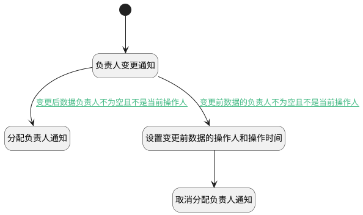

## 负责人变更附加逻辑 <!-- {docsify-ignore-all} -->

   产品需求负责人变更时触发相应的通知消息

### 处理过程

### 处理步骤说明

#### 开始 :id=Begin [开始]

*- N/A*
#### 负责人变更通知 :id=DENOTIFY2 [实体通知]

调用实体 [需求(IDEA)](module/ProdMgmt/idea.md) 通知 [负责人变更通知(assignee_onchange_notify)](module/ProdMgmt/idea/notify/assignee_onchange_notify) ，参数为`Default(传入变量)`
#### 设置变更前数据的操作人和操作时间 :id=PREPAREPARAM1 [准备参数]

1. 将`Default(传入变量).UPDATE_MAN(更新人)` 设置给  `Last(变更前).UPDATE_MAN`
2. 将`Default(传入变量).UPDATE_TIME(更新时间)` 设置给  `Last(变更前).UPDATE_TIME`

#### 取消分配负责人通知 :id=DENOTIFY3 [实体通知]

调用实体 [需求(IDEA)](module/ProdMgmt/idea.md) 通知 [取消分配负责人通知(assignee_cancel_notify)](module/ProdMgmt/idea/notify/assignee_cancel_notify) ，参数为`Last(变更前)`
#### 分配负责人通知 :id=DENOTIFY1 [实体通知]

调用实体 [需求(IDEA)](module/ProdMgmt/idea.md) 通知 [分配负责人通知(assignee_notify)](module/ProdMgmt/idea/notify/assignee_notify) ，参数为`Default(传入变量)`

### 连接条件说明
#### 变更后数据负责人不为空且不是当前操作人 :id=DENOTIFY2-DENOTIFY1

`Default(传入变量).ASSIGNEE_ID(负责人)` ISNOTNULL AND 
#### 变更前数据的负责人不为空且不是当前操作人 :id=DENOTIFY2-PREPAREPARAM1

`Last(变更前).ASSIGNEE_ID` ISNOTNULL AND 

### 实体逻辑参数

|    中文名   |    代码名    |  数据类型    |  实体   |备注 |
| --------| --------| -------- | -------- | --------   |
|传入变量(<i class="fa fa-check"/></i>)|Default|数据对象|[需求(IDEA)](module/ProdMgmt/idea.md)||
|变更前|Last|最后数据变量|||
