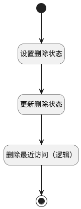

## 删除 <!-- {docsify-ignore-all} -->

   需求数据的逻辑删除，修改需求的是否删除属性值

### 处理过程




### 处理步骤说明

#### 开始 :id=Begin<sup class="footnote-symbol"> <font color=gray size=1>[开始]</font></sup>


*- N/A*
#### 设置删除状态 :id=PREPAREPARAM2<sup class="footnote-symbol"> <font color=gray size=1>[准备参数]</font></sup>


1. 将`1` 设置给  `Default(传入变量).IS_DELETED(是否已删除)`

#### 更新删除状态 :id=DEACTION1<sup class="footnote-symbol"> <font color=gray size=1>[实体行为]</font></sup>


调用实体 [需求(IDEA)](module/ProdMgmt/idea.md) 行为 [Update](module/ProdMgmt/idea#行为) ，行为参数为`Default(传入变量)`

#### 删除最近访问（逻辑） :id=RAWSQLCALL1<sup class="footnote-symbol"> <font color=gray size=1>[直接SQL调用]</font></sup>


<p class="panel-title"><b>执行sql语句</b></p>

```sql
update recent set IS_DELETED=1 where owner_id=? and owner_subtype='idea'
```

<p class="panel-title"><b>执行sql参数</b></p>

1. `Default(传入变量).ID(标识)`


#### 结束 :id=END1<sup class="footnote-symbol"> <font color=gray size=1>[结束]</font></sup>


*- N/A*


### 实体逻辑参数

|    中文名   |    代码名    |  数据类型    |  实体   |备注 |
| --------| --------| -------- | -------- | --------   |
|传入变量(<i class="fa fa-check"/></i>)|Default|数据对象|[需求(IDEA)](module/ProdMgmt/idea.md)||
|循环临时变量|for_temp_obj|数据对象|[需求(IDEA)](module/ProdMgmt/idea.md)||
|需求查询过滤器|idea_filter|过滤器|||
|需求分页结果对象|idea_page|分页查询|||
