## 获取客户分数 <!-- {docsify-ignore-all} -->

   获取客户分数数据

### 处理过程

```plantuml
@startuml
hide empty description
<style>
root {
  HyperlinkColor #42b983
}
</style>

hide empty description
state "开始" as Begin <<start>> [[$./get_customer_score#begin {"开始"}]]
state "结束" as END1 <<end>> [[$./get_customer_score#end1 {"结束"}]]
state "设置过滤器" as PREPAREPARAM1  [[$./get_customer_score#prepareparam1 {"设置过滤器"}]]
state "获取需求关联的客户" as DEDATASET1  [[$./get_customer_score#dedataset1 {"获取需求关联的客户"}]]
state "计算分数" as RAWSFCODE1  [[$./get_customer_score#rawsfcode1 {"计算分数"}]]


Begin --> PREPAREPARAM1
PREPAREPARAM1 --> DEDATASET1
DEDATASET1 --> RAWSFCODE1
RAWSFCODE1 --> END1


@enduml
```




### 处理步骤说明

#### 开始 :id=Begin<sup class="footnote-symbol"> <font color=gray size=1>[开始]</font></sup>


*- N/A*
#### 结束 :id=END1<sup class="footnote-symbol"> <font color=gray size=1>[结束]</font></sup>


返回 `result(返回结果)`

#### 设置过滤器 :id=PREPAREPARAM1<sup class="footnote-symbol"> <font color=gray size=1>[准备参数]</font></sup>


1. 将`Default(传入变量).ID(标识)` 设置给  `filter(过滤器).N_PRINCIPAL_ID_EQ`
2. 将`customer` 设置给  `filter(过滤器).N_TARGET_TYPE_EQ`

#### 获取需求关联的客户 :id=DEDATASET1<sup class="footnote-symbol"> <font color=gray size=1>[实体数据集]</font></sup>


调用实体 [关联(RELATION)](module/Base/relation.md) 数据集合 [全部数据(all)](module/Base/relation#数据集合) ，查询参数为`filter(过滤器)`

将执行结果返回给参数`relation_page(关系分页结果)`

#### 计算分数 :id=RAWSFCODE1<sup class="footnote-symbol"> <font color=gray size=1>[直接后台代码]</font></sup>


<p class="panel-title"><b>执行代码[Groovy]</b></p>

```groovy
def list = logic.param("relation_page").getReal().content
def result = logic.param("result").getReal()
def score = 0
list.each{ item -> 
    sys.info('level', item.get("level"))
    switch(item.get("level")) {
        case '10':
            score += 3
            break
        case '20':
            score += 2
            break
        case '30':
            score += 1
            break
        case '40':
            score += 0
            break
        case '50':
            score += 1
            break
        default:
            score += 0;
    }
}

result.set("customer_score", score + "分") 
if (list.size() != 0) {
    result.set("customer_score_precent", score / (list.size() * 3))
} else {
    result.set("customer_score_precent", 0)
}
```


### 实体逻辑参数

|    中文名   |    代码名    |  数据类型    |  实体   |备注 |
| --------| --------| -------- | -------- | --------   |
|传入变量(<i class="fa fa-check"/></i>)|Default|数据对象|[需求(IDEA)](module/ProdMgmt/idea.md)||
|过滤器|filter|过滤器|||
|关系分页结果|relation_page|分页查询|||
|返回结果|result|数据对象|[需求(IDEA)](module/ProdMgmt/idea.md)||
