## 获取工单数量 <!-- {docsify-ignore-all} -->

   获取工单数量数据

### 处理过程

```plantuml
@startuml
hide empty description
<style>
root {
  HyperlinkColor #42b983
}
</style>

hide empty description
state "开始" as Begin <<start>> [[$./get_ticket_num#begin {"开始"}]]
state "结束" as END1 <<end>> [[$./get_ticket_num#end1 {"结束"}]]
state "直接SQL调用" as RAWSQLCALL1  [[$./get_ticket_num#rawsqlcall1 {"直接SQL调用"}]]


Begin --> RAWSQLCALL1
RAWSQLCALL1 --> END1


@enduml
```




### 处理步骤说明

#### 开始 :id=Begin<sup class="footnote-symbol"> <font color=gray size=1>[开始]</font></sup>


*- N/A*
#### 结束 :id=END1<sup class="footnote-symbol"> <font color=gray size=1>[结束]</font></sup>


返回 `result(返回结果)`

#### 直接SQL调用 :id=RAWSQLCALL1<sup class="footnote-symbol"> <font color=gray size=1>[直接SQL调用]</font></sup>


<p class="panel-title"><b>执行sql语句</b></p>

```sql
select count(num) count_num, sum(num) sum_num 
from (select CASE
                 WHEN t2.TYPE = 'completed' THEN 1
                 ELSE 0
                 END num
      from ticket t1
               left join dictionary t2 on t1.STATE = t2.VAL and t2.CATALOG = 'ticket_state'
      where t1.id in (select TARGET_ID ticket_id
                      from relation
                      where PRINCIPAL_ID = ?
                        and PRINCIPAL_TYPE = 'idea'
                        and TARGET_TYPE = 'ticket')
      and t1.IS_DELETED = 0) as t1
```

<p class="panel-title"><b>执行sql参数</b></p>

1. `Default(传入变量).ID(标识)`

重置参数`result(返回结果)`，并将执行sql结果赋值给参数`result(返回结果)`


### 实体逻辑参数

|    中文名   |    代码名    |  数据类型    |  实体   |备注 |
| --------| --------| -------- | -------- | --------   |
|传入变量(<i class="fa fa-check"/></i>)|Default|数据对象|[需求(IDEA)](module/ProdMgmt/idea.md)||
|过滤器|filter|过滤器|||
|关系分页结果|relation_page|分页查询|||
|返回结果|result|数据对象|[需求(IDEA)](module/ProdMgmt/idea.md)||
