## 获取默认模块 <!-- {docsify-ignore-all} -->

   获取需求的默认模块

### 处理过程

```plantuml
@startuml
hide empty description
<style>
root {
  HyperlinkColor #42b983
}
</style>

hide empty description
state "开始" as Begin <<start>> [[$./idea_category#begin {"开始"}]]
state "设置category_id" as PREPAREPARAM1  [[$./idea_category#prepareparam1 {"设置category_id"}]]
state "获取category" as DEACTION1  [[$./idea_category#deaction1 {"获取category"}]]
state "设置category_name" as PREPAREPARAM2  [[$./idea_category#prepareparam2 {"设置category_name"}]]
state "结束" as END1 <<end>> [[$./idea_category#end1 {"结束"}]]


Begin --> PREPAREPARAM1
PREPAREPARAM1 --> DEACTION1
DEACTION1 --> PREPAREPARAM2
PREPAREPARAM2 --> END1


@enduml
```

### 处理步骤说明

#### 开始 :id=Begin [开始]

*- N/A*
#### 设置category_id :id=PREPAREPARAM1 [准备参数]

1. 将`Default(传入变量).category_id(类别标识)` 设置给  `category(模块).ID(标识)`

#### 获取category :id=DEACTION1 [实体行为]

调用实体 [类别(CATEGORY)](module/Base/category.md) 行为 [Get](module/Base/category#行为) ，行为参数为`category(模块)`

将执行结果返回给参数`category(模块)`

#### 设置category_name :id=PREPAREPARAM2 [准备参数]

1. 将`category(模块).NAME(名称)` 设置给  `Default(传入变量).CATEGORY_NAME(名称)`

#### 结束 :id=END1 [结束]

返回 `Default(传入变量)`

### 实体逻辑参数

|    中文名   |    代码名    |  数据类型    |  实体   |备注 |
| --------| --------| -------- | -------- | --------   |
|传入变量(<i class="fa fa-check"/></i>)|Default|数据对象|[需求(IDEA)](module/ProdMgmt/idea.md)||
|模块|category|数据对象|[类别(CATEGORY)](module/Base/category.md)||
