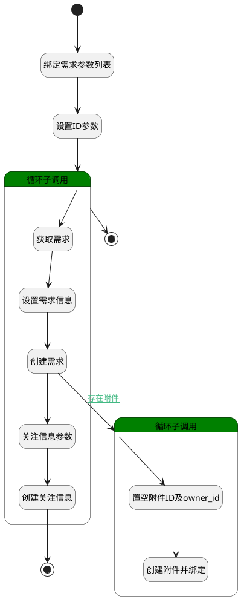

## 需求复制 <!-- {docsify-ignore-all} -->

   复制需求至其他产品（复制需求信息，在目标产品中创建新需求）

### 处理过程

### 处理步骤说明

#### 开始 :id=Begin [开始]

*- N/A*
#### 绑定需求参数列表 :id=BINDPARAM1 [绑定参数]

绑定参数`Default(传入变量)` 到 `srfactionparam(选择的数据对象)`
#### 设置ID参数 :id=PREPAREPARAM3 [准备参数]

1. 将`Default(传入变量).ID(标识)` 绑定给  `id(拆分的主键)`

#### 循环子调用 :id=LOOPSUBCALL1 [循环子调用]

根据选中ID进行循环调用

循环参数`srfactionparam(选择的数据对象)`，子循环参数使用`for_temp_obj(循环临时变量)`
#### 获取需求 :id=DEACTION2 [实体行为]

调用实体 [需求(IDEA)](module/ProdMgmt/idea.md) 行为 [Get](module/ProdMgmt/idea#行为) ，行为参数为`id(拆分的主键)`

将执行结果返回给参数`temp_obj(临时变量)`

#### 设置需求信息 :id=PREPAREPARAM1 [准备参数]

1、拷贝查询的需求详情给idea_new
2、将附件数据单独拿出来备用
3、获取传入的目标产品ID，作为idea_new的产品ID。
4、置空附件信息。（带附件无法新建）
5、获取传入的目标模块ID给idea_new。
6、置空ID。

1. 将`temp_obj(临时变量)` 拷贝到  `idea_new(新需求)`
2. 将`空值（NULL）` 设置给  `idea_new(新需求).ATTENTIONS(关注)`
3. 将`temp_obj(临时变量).ATTACHMENTS(附件)` 绑定给  `attachments(附件列表)`
4. 将`for_temp_obj(循环临时变量).target_product_id` 设置给  `idea_new(新需求).PRODUCT_ID(产品)`
5. 将`空值（NULL）` 设置给  `idea_new(新需求).ATTACHMENTS(附件)`
6. 将`for_temp_obj(循环临时变量).CATEGORY_ID(类别标识)` 设置给  `idea_new(新需求).CATEGORY_ID(类别标识)`
7. 将`空值（NULL）` 设置给  `idea_new(新需求).ID(标识)`
8. 将` ==> idea_new[IDENTIFIER]` 设置给  `idea_new(新需求).IDENTIFIER(编号)`

#### 创建需求 :id=DEACTION1 [实体行为]

调用实体 [需求(IDEA)](module/ProdMgmt/idea.md) 行为 [Create](module/ProdMgmt/idea#行为) ，行为参数为`idea_new(新需求)`

#### 循环子调用 :id=LOOPSUBCALL2 [循环子调用]

循环参数`attachments(附件列表)`，子循环参数使用`attachment(附件)`
#### 置空附件ID及owner_id :id=PREPAREPARAM2 [准备参数]

1. 将`空值（NULL）` 设置给  `attachment(附件).ID(标识)`
2. 将`idea_new(新需求).ID(标识)` 设置给  `attachment(附件).OWNER_ID(所属数据标识)`
3. 将`IDEA` 设置给  `attachment(附件).OWNER_TYPE(所属数据对象)`

#### 创建附件并绑定 :id=DEACTION3 [实体行为]

调用实体 [附件(ATTACHMENT)](module/Base/attachment.md) 行为 [Create](module/Base/attachment#行为) ，行为参数为`attachment(附件)`

#### 结束 :id=END1 [结束]

*- N/A*

#### 关注信息参数 :id=PREPAREPARAM4 [准备参数]

1. 将`空值（NULL）` 设置给  `attention(关注人).ID(标识)`
2. 将`用户全局对象.srfusername` 设置给  `attention(关注人).NAME(名称)`
3. 将`IDEA` 设置给  `attention(关注人).OWNER_SUBTYPE(所属对象子类型)`
4. 将`用户全局对象.srfpersonid` 设置给  `attention(关注人).USER_ID(关注人)`
5. 将`idea_new(新需求).ID(标识)` 设置给  `attention(关注人).OWNER_ID(所属数据标识)`
6. 将`IDEA` 设置给  `attention(关注人).OWNER_TYPE(所属数据对象)`

#### 创建关注信息 :id=DEACTION4 [实体行为]

调用实体 [关注(ATTENTION)](module/Base/attention.md) 行为 [Create](module/Base/attention#行为) ，行为参数为`attention(关注人)`

#### 结束 :id=END2 [结束]

*- N/A*

### 连接条件说明
#### 存在附件 :id=DEACTION1-LOOPSUBCALL2

`temp_obj(临时变量).attachments(附件)` ISNOTNULL

### 实体逻辑参数

|    中文名   |    代码名    |  数据类型    |  实体   |备注 |
| --------| --------| -------- | -------- | --------   |
|传入变量(<i class="fa fa-check"/></i>)|Default|数据对象|[需求(IDEA)](module/ProdMgmt/idea.md)||
|附件|attachment|数据对象|[附件(ATTACHMENT)](module/Base/attachment.md)||
|附件列表|attachments|数据对象列表|[附件(ATTACHMENT)](module/Base/attachment.md)||
|关注人|attention|数据对象|[关注(ATTENTION)](module/Base/attention.md)||
|关注人列表|attentions|数据对象列表|[关注(ATTENTION)](module/Base/attention.md)||
|循环临时变量|for_temp_obj|数据对象|[需求(IDEA)](module/ProdMgmt/idea.md)||
|拆分的主键|id|简单数据|||
|新需求|idea_new|数据对象|[需求(IDEA)](module/ProdMgmt/idea.md)||
|选择的数据对象|srfactionparam|数据对象列表|[需求(IDEA)](module/ProdMgmt/idea.md)||
|临时变量|temp_obj|数据对象|[需求(IDEA)](module/ProdMgmt/idea.md)||
