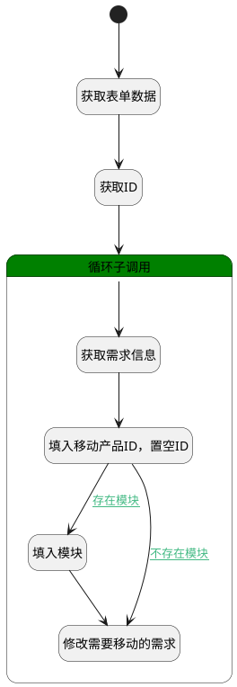

## 需求移动 <!-- {docsify-ignore-all} -->

   移动需求至其他位置（修改需求的所属产品，重新生成编号）

### 处理过程

### 处理步骤说明

#### 开始 :id=Begin [开始]

*- N/A*
#### 获取表单数据 :id=BINDPARAM1 [绑定参数]

绑定参数`Default(传入变量)` 到 `srfactionparam(选择的数据对象)`
#### 获取ID :id=BINDPARAM2 [绑定参数]

绑定参数`Default(传入变量)` 到 `id(要更改状态的主键)`
#### 循环子调用 :id=LOOPSUBCALL1 [循环子调用]

循环参数`srfactionparam(选择的数据对象)`，子循环参数使用`for_temp_obj(循环临时变量)`
#### 获取需求信息 :id=DEACTION2 [实体行为]

调用实体 [需求(IDEA)](module/ProdMgmt/idea.md) 行为 [Get](module/ProdMgmt/idea#行为) ，行为参数为`id(要更改状态的主键)`

将执行结果返回给参数`temp_obj(临时变量)`

#### 填入移动产品ID，置空ID :id=PREPAREPARAM1 [准备参数]

1. 将`for_temp_obj(循环临时变量).target_product_id` 设置给  `temp_obj(临时变量).PRODUCT_ID(产品)`
2. 将` ==> temp_obj[IDENTIFIER]` 设置给  `temp_obj(临时变量).IDENTIFIER(编号)`
3. 将`Default(传入变量).ID(标识)` 设置给  `temp_obj(临时变量).ID(标识)`

#### 填入模块 :id=PREPAREPARAM2 [准备参数]

1. 将`for_temp_obj(循环临时变量).CATEGORY_ID(类别标识)` 设置给  `temp_obj(临时变量).CATEGORY_ID(类别标识)`

#### 修改需要移动的需求 :id=DEACTION1 [实体行为]

调用实体 [需求(IDEA)](module/ProdMgmt/idea.md) 行为 [Update](module/ProdMgmt/idea#行为) ，行为参数为`temp_obj(临时变量)`

### 连接条件说明
#### 存在模块 :id=PREPAREPARAM1-PREPAREPARAM2

`for_temp_obj(循环临时变量).CATEGORY_ID(类别标识)` ISNOTNULL
#### 不存在模块 :id=PREPAREPARAM1-DEACTION1

`for_temp_obj(循环临时变量).CATEGORY_ID(类别标识)` ISNULL

### 实体逻辑参数

|    中文名   |    代码名    |  数据类型    |  实体   |备注 |
| --------| --------| -------- | -------- | --------   |
|传入变量(<i class="fa fa-check"/></i>)|Default|数据对象|[需求(IDEA)](module/ProdMgmt/idea.md)||
|循环临时变量|for_temp_obj|数据对象|[需求(IDEA)](module/ProdMgmt/idea.md)||
|要更改状态的主键|id|简单数据|||
|新建的需求|new_idea|数据对象|[需求(IDEA)](module/ProdMgmt/idea.md)||
|选择的数据对象|srfactionparam|数据对象列表|[需求(IDEA)](module/ProdMgmt/idea.md)||
|临时变量|temp_obj|数据对象|[需求(IDEA)](module/ProdMgmt/idea.md)||
