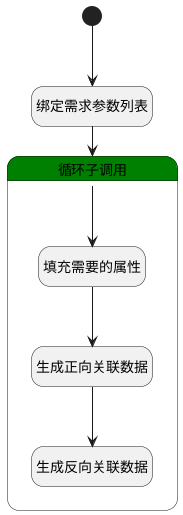

## 需求排期 <!-- {docsify-ignore-all} -->

   需求排期，用户在排期内关联相应需求，生成正反向关联关系

### 处理过程

### 处理步骤说明

#### 开始 :id=Begin [开始]

*- N/A*
#### 绑定需求参数列表 :id=BINDPARAM1 [绑定参数]

绑定参数`Default(传入变量)` 到 `srfactionparam(选择数据对象)`
#### 循环子调用 :id=LOOPSUBCALL1 [循环子调用]

循环参数`srfactionparam(选择数据对象)`，子循环参数使用`for_temp_obj(循环临时变量)`
#### 填充需要的属性 :id=PREPAREPARAM1 [准备参数]

1. 将`Default(传入变量).ID(标识)` 设置给  `relationobj(关系对象).PRINCIPAL_ID(关联主体标识)`
2. 将`idea` 设置给  `relationobj(关系对象).PRINCIPAL_TYPE(关联主体类型)`
3. 将`for_temp_obj(循环临时变量).target_plan_id` 设置给  `relationobj(关系对象).TARGET_ID(目标主体标识)`
4. 将`product_plan` 设置给  `relationobj(关系对象).TARGET_TYPE(关联目标类型)`
5. 将`for_temp_obj(循环临时变量).target_plan_id` 设置给  `relationobj2(反向关系对象).PRINCIPAL_ID(关联主体标识)`
6. 将`product_plan` 设置给  `relationobj2(反向关系对象).PRINCIPAL_TYPE(关联主体类型)`
7. 将`Default(传入变量).ID(标识)` 设置给  `relationobj2(反向关系对象).TARGET_ID(目标主体标识)`
8. 将`idea` 设置给  `relationobj2(反向关系对象).TARGET_TYPE(关联目标类型)`

#### 生成正向关联数据 :id=DEACTION1 [实体行为]

调用实体 [关联(RELATION)](module/Base/relation.md) 行为 [Save](module/Base/relation#行为) ，行为参数为`relationobj(关系对象)`

#### 生成反向关联数据 :id=DEACTION2 [实体行为]

调用实体 [关联(RELATION)](module/Base/relation.md) 行为 [Save](module/Base/relation#行为) ，行为参数为`relationobj2(反向关系对象)`

### 实体逻辑参数

|    中文名   |    代码名    |  数据类型    |  实体   |备注 |
| --------| --------| -------- | -------- | --------   |
|传入变量(<i class="fa fa-check"/></i>)|Default|数据对象|[需求(IDEA)](module/ProdMgmt/idea.md)||
|循环临时变量|for_temp_obj|数据对象|[需求(IDEA)](module/ProdMgmt/idea.md)||
|关系对象|relationobj|数据对象|[关联(RELATION)](module/Base/relation.md)||
|反向关系对象|relationobj2|数据对象|[关联(RELATION)](module/Base/relation.md)||
|选择数据对象|srfactionparam|数据对象列表|[需求(IDEA)](module/ProdMgmt/idea.md)||
