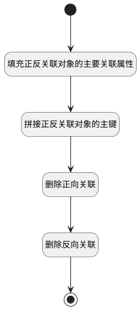

## 计划取消关联需求 <!-- {docsify-ignore-all} -->

   排期（计划）内取消关联需求，删除正反向关联数据

### 处理过程




### 处理步骤说明

#### 开始 :id=Begin<sup class="footnote-symbol"> <font color=gray size=1>[开始]</font></sup>


*- N/A*
#### 填充正反关联对象的主要关联属性 :id=PREPAREPARAM1<sup class="footnote-symbol"> <font color=gray size=1>[准备参数]</font></sup>


1. 将`Default(传入变量).principal_id` 设置给  `forward_relation_obj(正向关联对象).PRINCIPAL_ID(关联主体标识)`
2. 将`product_plan` 设置给  `forward_relation_obj(正向关联对象).PRINCIPAL_TYPE(关联主体类型)`
3. 将`idea` 设置给  `reverse_relation_obj(反向关联对象).PRINCIPAL_TYPE(关联主体类型)`
4. 将`Default(传入变量).principal_id` 设置给  `reverse_relation_obj(反向关联对象).TARGET_ID(目标主体标识)`
5. 将`Default(传入变量).ID(标识)` 设置给  `reverse_relation_obj(反向关联对象).PRINCIPAL_ID(关联主体标识)`
6. 将`Default(传入变量).ID(标识)` 设置给  `forward_relation_obj(正向关联对象).TARGET_ID(目标主体标识)`

#### 拼接正反关联对象的主键 :id=RAWSFCODE1<sup class="footnote-symbol"> <font color=gray size=1>[直接后台代码]</font></sup>


<p class="panel-title"><b>执行代码[JavaScript]</b></p>

```javascript
// 获取正向关联对象的主键
var forward_relation_obj = logic.getParam("forward_relation_obj");
if(forward_relation_obj.get("principal_id") != null && forward_relation_obj.get("target_id") != null && forward_relation_obj.get("principal_type") != null){
    forward_relation_obj.set("id", forward_relation_obj.get("principal_id") + "_" + forward_relation_obj.get("target_id") + '_' + forward_relation_obj.get("principal_type"));
}
// 获取反向关联对象的主键
var reverse_relation_obj = logic.getParam("reverse_relation_obj");
if(reverse_relation_obj.get("principal_id") != null && reverse_relation_obj.get("target_id") != null && reverse_relation_obj.get("principal_type") != null){
    reverse_relation_obj.set("id", reverse_relation_obj.get("principal_id") + "_" + reverse_relation_obj.get("target_id") + '_' + reverse_relation_obj.get("principal_type"));
}
```

#### 删除正向关联 :id=DEACTION2<sup class="footnote-symbol"> <font color=gray size=1>[实体行为]</font></sup>


调用实体 [关联(RELATION)](module/Base/relation.md) 行为 [Remove](module/Base/relation#行为) ，行为参数为`forward_relation_obj(正向关联对象)`

#### 删除反向关联 :id=DEACTION3<sup class="footnote-symbol"> <font color=gray size=1>[实体行为]</font></sup>


调用实体 [关联(RELATION)](module/Base/relation.md) 行为 [Remove](module/Base/relation#行为) ，行为参数为`reverse_relation_obj(反向关联对象)`

#### 结束 :id=END1<sup class="footnote-symbol"> <font color=gray size=1>[结束]</font></sup>


*- N/A*


### 实体逻辑参数

|    中文名   |    代码名    |  数据类型    |  实体   |备注 |
| --------| --------| -------- | -------- | --------   |
|传入变量(<i class="fa fa-check"/></i>)|Default|数据对象|[需求(IDEA)](module/ProdMgmt/idea.md)||
|正向关联对象|forward_relation_obj|数据对象|[关联(RELATION)](module/Base/relation.md)||
|反向关联对象|reverse_relation_obj|数据对象|[关联(RELATION)](module/Base/relation.md)||
