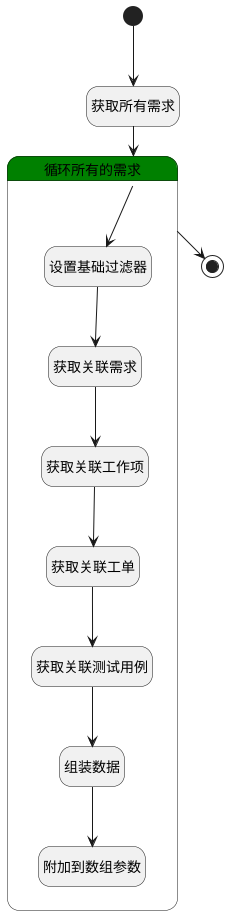

## 排期跟踪数据 <!-- {docsify-ignore-all} -->

   返回该排期中所有的需求以及需求的关联数据

### 处理过程

### 处理步骤说明

#### 开始 :id=Begin [开始]

*- N/A*
#### 获取所有需求 :id=DEDATASET1 [实体数据集]

调用实体 [需求(IDEA)](module/ProdMgmt/idea.md) 数据集合 [计划关联需求(plan_relation_idea)](module/ProdMgmt/idea#数据集合) ，查询参数为`Default(传入变量)`

将执行结果返回给参数`page_ideas(排期内所有的需求)`

#### 结束 :id=END1 [结束]

返回 `result(结果)`

#### 循环所有的需求 :id=LOOPSUBCALL1 [循环子调用]

循环参数`page_ideas(排期内所有的需求)`，子循环参数使用`idea(需求实体)`
#### 设置基础过滤器 :id=PREPAREPARAM2 [准备参数]

1. 将`idea(需求实体).ID(标识)` 设置给  `base_filter(基础过滤器).principal_id`

#### 获取关联需求 :id=DEDATASET2 [实体数据集]

调用实体 [需求(IDEA)](module/ProdMgmt/idea.md) 数据集合 [关联需求(relation_idea)](module/ProdMgmt/idea#数据集合) ，查询参数为`base_filter(基础过滤器)`

将执行结果返回给参数`re_page_idea(关联需求分页结果)`

#### 获取关联工作项 :id=DEDATASET3 [实体数据集]

调用实体 [工作项(WORK_ITEM)](module/ProjMgmt/work_item.md) 数据集合 [关联工作项(relation_work_item)](module/ProjMgmt/work_item#数据集合) ，查询参数为`base_filter(基础过滤器)`

将执行结果返回给参数`re_page_item(关联工作项分页结果)`

#### 获取关联工单 :id=DEDATASET4 [实体数据集]

调用实体 [工单(TICKET)](module/ProdMgmt/ticket.md) 数据集合 [关联工单(relation_ticket)](module/ProdMgmt/ticket#数据集合) ，查询参数为`base_filter(基础过滤器)`

将执行结果返回给参数`re_page_ticket(关联工单分页结果)`

#### 获取关联测试用例 :id=DEDATASET5 [实体数据集]

调用实体 [用例(TEST_CASE)](module/TestMgmt/test_case.md) 数据集合 [关联测试用例(relation_test_case)](module/TestMgmt/test_case#数据集合) ，查询参数为`base_filter(基础过滤器)`

将执行结果返回给参数`re_page_case(关联测试用例分页结果)`

#### 组装数据 :id=PREPAREPARAM1 [准备参数]

1. 将`re_page_idea(关联需求分页结果)` 设置给  `idea(需求实体).re_idea`
2. 将`re_page_idea(关联需求分页结果).size` 设置给  `idea(需求实体).idea_sum`
3. 将`re_page_item(关联工作项分页结果).size` 设置给  `idea(需求实体).work_item_sum`
4. 将`re_page_ticket(关联工单分页结果).size` 设置给  `idea(需求实体).ticket_sum`
5. 将`re_page_case(关联测试用例分页结果).size` 设置给  `idea(需求实体).test_case_sum`
6. 将`re_page_item(关联工作项分页结果)` 设置给  `idea(需求实体).re_item`
7. 将`re_page_case(关联测试用例分页结果)` 设置给  `idea(需求实体).re_case`
8. 将`re_page_ticket(关联工单分页结果)` 设置给  `idea(需求实体).re_ticket`

#### 附加到数组参数 :id=APPENDPARAM1 [附加到数组参数]

将参数`idea(需求实体)` 添加到数组参数`result(结果)`

### 实体逻辑参数

|    中文名   |    代码名    |  数据类型    |  实体   |备注 |
| --------| --------| -------- | -------- | --------   |
|传入变量(<i class="fa fa-check"/></i>)|Default|过滤器|||
|基础过滤器|base_filter|过滤器|||
|需求实体|idea|数据对象|[需求(IDEA)](module/ProdMgmt/idea.md)||
|排期内所有的需求|page_ideas|分页查询|||
|关联测试用例分页结果|re_page_case|分页查询|||
|关联需求分页结果|re_page_idea|分页查询|||
|关联工作项分页结果|re_page_item|分页查询|||
|关联工单分页结果|re_page_ticket|分页查询|||
|结果|result|数据对象列表|||
