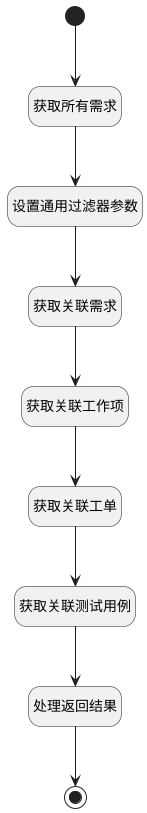

## 排期跟踪数据 <!-- {docsify-ignore-all} -->

   返回该排期中所有的需求以及需求的关联数据

### 处理过程




### 处理步骤说明

#### 开始 :id=Begin<sup class="footnote-symbol"> <font color=gray size=1>[开始]</font></sup>


*- N/A*
#### 获取所有需求 :id=DEDATASET1<sup class="footnote-symbol"> <font color=gray size=1>[实体数据集]</font></sup>


调用实体 [需求(IDEA)](module/ProdMgmt/idea.md) 数据集合 [计划关联需求(plan_relation_idea)](module/ProdMgmt/idea#数据集合) ，查询参数为`Default(传入变量)`

将执行结果返回给参数`page_ideas(排期内所有的需求)`

#### 设置通用过滤器参数 :id=RAWSFCODE1<sup class="footnote-symbol"> <font color=gray size=1>[直接后台代码]</font></sup>


<p class="panel-title"><b>执行代码[Groovy]</b></p>

```groovy
def _default = logic.param('Default').getReal()
def base_filter = logic.param('base_filter').getReal()
String principal_id = _default.get("principal_id")
base_filter.set("principal_id", "'" + principal_id + "'")
base_filter.all()
```

#### 获取关联需求 :id=DEDATASET2<sup class="footnote-symbol"> <font color=gray size=1>[实体数据集]</font></sup>


调用实体 [需求(IDEA)](module/ProdMgmt/idea.md) 数据集合 [关联需求（多需求）(ideas_relation_idea)](module/ProdMgmt/idea#数据集合) ，查询参数为`base_filter(基础过滤器)`

将执行结果返回给参数`re_page_idea(关联需求分页结果)`

#### 获取关联工作项 :id=DEDATASET3<sup class="footnote-symbol"> <font color=gray size=1>[实体数据集]</font></sup>


调用实体 [工作项(WORK_ITEM)](module/ProjMgmt/work_item.md) 数据集合 [关联工作项（多需求）(ideas_relation_work_item)](module/ProjMgmt/work_item#数据集合) ，查询参数为`base_filter(基础过滤器)`

将执行结果返回给参数`re_page_item(关联工作项分页结果)`

#### 获取关联工单 :id=DEDATASET4<sup class="footnote-symbol"> <font color=gray size=1>[实体数据集]</font></sup>


调用实体 [工单(TICKET)](module/ProdMgmt/ticket.md) 数据集合 [关联工单（多需求）(ideas_relation_ticket)](module/ProdMgmt/ticket#数据集合) ，查询参数为`base_filter(基础过滤器)`

将执行结果返回给参数`re_page_ticket(关联工单分页结果)`

#### 获取关联测试用例 :id=DEDATASET5<sup class="footnote-symbol"> <font color=gray size=1>[实体数据集]</font></sup>


调用实体 [用例(TEST_CASE)](module/TestMgmt/test_case.md) 数据集合 [关联测试用例（多需求）(ideas_relation_test_case)](module/TestMgmt/test_case#数据集合) ，查询参数为`base_filter(基础过滤器)`

将执行结果返回给参数`re_page_case(关联测试用例分页结果)`

#### 处理返回结果 :id=RAWSFCODE2<sup class="footnote-symbol"> <font color=gray size=1>[直接后台代码]</font></sup>


<p class="panel-title"><b>执行代码[Groovy]</b></p>

```groovy
def page_ideas = logic.param('page_ideas').getReal()
def relation_idea = logic.param('re_page_idea').getReal()
def relation_work_item = logic.param('re_page_item').getReal()
def relation_ticket = logic.param('re_page_ticket').getReal()
def relation_test_case = logic.param('re_page_case').getReal()
def result = logic.param('result').getReal()


// 5. 主循环处理
page_ideas.each { idea ->
    String id = idea.get("id")

    List<Object> relationIdeaList = new ArrayList<Object>()
    List<Object> relationWorkItemList = new ArrayList<Object>()
    List<Object> relationTicketList = new ArrayList<Object>()
    List<Object> relationCaseList = new ArrayList<Object>()

    relation_idea.each { it ->
        String principal_id = it.get("principal_id")
        if (principal_id.equals(id)) {
            relationIdeaList.add(it)
        }
    }
    relation_work_item.each { it ->
        String principal_id = it.get("principal_id")
        if (principal_id.equals(id)) {
            relationWorkItemList.add(it)
        }
    }
    relation_ticket.each { it ->
        String principal_id = it.get("principal_id")
        if (principal_id.equals(id)) {
            relationTicketList.add(it)

        }
    }
    relation_test_case.each { it ->
        String principal_id = it.get("principal_id")
        if (principal_id.equals(id)) {
            relationCaseList.add(it)
        }
    }
    def re_idea = sys.createEntity(null, false)
    def re_item = sys.createEntity(null, false)
    def re_ticket = sys.createEntity(null, false)
    def re_case = sys.createEntity(null, false)

    re_idea.set("content", relationIdeaList)
    re_item.set("content", relationWorkItemList)
    re_ticket.set("content", relationTicketList)
    re_case.set("content", relationCaseList)

    // 组装数据
    idea.set("re_idea", re_idea)
    idea.set("re_item", re_item)
    idea.set("re_ticket", re_ticket)
    idea.set("re_case", re_case)
    idea.set("idea_sum", relationIdeaList.size())
    idea.set("work_item_sum", relationWorkItemList.size())
    idea.set("ticket_sum", relationTicketList.size())
    idea.set("test_case_sum", relationCaseList.size())

    // 添加到结果集
    result.add(idea)
}
```

#### 结束 :id=END<sup class="footnote-symbol"> <font color=gray size=1>[结束]</font></sup>


返回 `result(结果)`


### 实体逻辑参数

|    中文名   |    代码名    |  数据类型    |  实体   |备注 |
| --------| --------| -------- | -------- | --------   |
|传入变量(<i class="fa fa-check"/></i>)|Default|过滤器|||
|基础过滤器|base_filter|过滤器|||
|需求实体|idea|数据对象|[需求(IDEA)](module/ProdMgmt/idea.md)||
|排期内所有的需求|page_ideas|分页查询|||
|关联测试用例分页结果|re_page_case|分页查询|||
|关联需求分页结果|re_page_idea|分页查询|||
|关联工作项分页结果|re_page_item|分页查询|||
|关联工单分页结果|re_page_ticket|分页查询|||
|结果|result|数据对象列表|||
