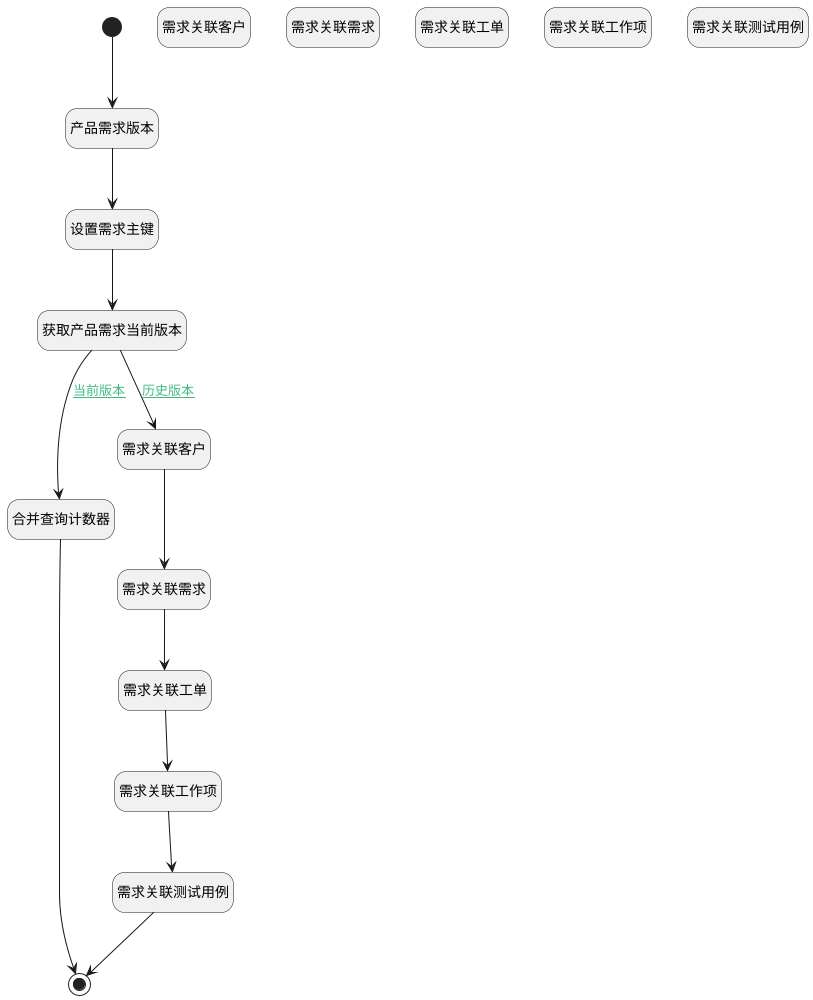

## 产品需求关联分页计数器 <!-- {docsify-ignore-all} -->

   计算分页下关联事项的条数

### 处理过程




### 处理步骤说明

#### 需求关联客户 :id=RAWSQLCALL1<sup class="footnote-symbol"> <font color=gray size=1>[直接SQL调用]</font></sup>


<p class="panel-title"><b>执行sql语句</b></p>

```sql
-- 需求关联客户
SELECT
	count( t.id ) AS idea_re_customer 
FROM
	customer t 
WHERE
	EXISTS (
	SELECT
		* 
	FROM
		`RELATION` t11 
	WHERE
		t.`ID` = t11.`TARGET_ID` 
		AND (
			t11.`TARGET_TYPE` = 'customer' 
			AND t11.`PRINCIPAL_TYPE` = 'idea' 
			AND t11.`PRINCIPAL_ID` = ? ) )
```

<p class="panel-title"><b>执行sql参数</b></p>

1. `Default(传入变量).ID(标识)`

重置参数`Default(传入变量)`，并将执行sql结果赋值给参数`Default(传入变量)`

#### 需求关联需求 :id=RAWSQLCALL2<sup class="footnote-symbol"> <font color=gray size=1>[直接SQL调用]</font></sup>


<p class="panel-title"><b>执行sql语句</b></p>

```sql
-- 需求
SELECT
	count( t.id ) AS idea_re_idea 
FROM
	idea t 
WHERE
	EXISTS (
	SELECT
		* 
	FROM
		`RELATION` t11 
	WHERE
		t.`ID` = t11.`TARGET_ID` 
		AND ( t11.`PRINCIPAL_ID` = ? AND t11.`TARGET_TYPE` = 'idea' AND t11.`PRINCIPAL_TYPE` = 'idea' ) 
	)  AND t.IS_DELETED = 0
	
```

<p class="panel-title"><b>执行sql参数</b></p>

1. `Default(传入变量).ID(标识)`

重置参数`Default(传入变量)`，并将执行sql结果赋值给参数`Default(传入变量)`

#### 需求关联工单 :id=RAWSQLCALL3<sup class="footnote-symbol"> <font color=gray size=1>[直接SQL调用]</font></sup>


<p class="panel-title"><b>执行sql语句</b></p>

```sql
-- 工单
SELECT
	count( t.id ) AS idea_re_ticket 
FROM
	ticket t 
WHERE
	EXISTS (
	SELECT
		* 
	FROM
		`RELATION` t11 
	WHERE
		t.`ID` = t11.`TARGET_ID` 
		AND ( t11.`PRINCIPAL_ID` = ? AND t11.`TARGET_TYPE` = 'ticket' AND t11.`PRINCIPAL_TYPE` = 'idea' ) 
	) 
	AND t.`IS_DELETED` = 0
```

<p class="panel-title"><b>执行sql参数</b></p>

1. `Default(传入变量).ID(标识)`

重置参数`Default(传入变量)`，并将执行sql结果赋值给参数`Default(传入变量)`

#### 需求关联工作项 :id=RAWSQLCALL4<sup class="footnote-symbol"> <font color=gray size=1>[直接SQL调用]</font></sup>


<p class="panel-title"><b>执行sql语句</b></p>

```sql
-- 工作项
SELECT
	count( t.id ) AS idea_re_work_item 
FROM
	work_item t 
WHERE
	EXISTS (
	SELECT
		* 
	FROM
		`RELATION` t11 
	WHERE
		t.`ID` = t11.`TARGET_ID` 
		AND ( t11.`PRINCIPAL_ID` = ? AND t11.`TARGET_TYPE` = 'work_item' AND t11.`PRINCIPAL_TYPE` = 'idea' ) 
	) 
	AND t.`IS_DELETED` = 0
```

<p class="panel-title"><b>执行sql参数</b></p>

1. `Default(传入变量).ID(标识)`

重置参数`Default(传入变量)`，并将执行sql结果赋值给参数`Default(传入变量)`

#### 需求关联测试用例 :id=RAWSQLCALL5<sup class="footnote-symbol"> <font color=gray size=1>[直接SQL调用]</font></sup>


<p class="panel-title"><b>执行sql语句</b></p>

```sql
-- 测试用例
SELECT
	count( t.id ) AS idea_re_test_case
FROM
	test_case t 
WHERE
	EXISTS (
	SELECT
		* 
	FROM
		`RELATION` t11 
	WHERE
		t.`ID` = t11.`TARGET_ID` 
		AND ( t11.`PRINCIPAL_ID` = ? AND t11.`TARGET_TYPE` = 'test_case' AND t11.`PRINCIPAL_TYPE` = 'idea' ) 
	) 
	AND t.`IS_DELETED` = 0
```

<p class="panel-title"><b>执行sql参数</b></p>

1. `Default(传入变量).ID(标识)`

重置参数`Default(传入变量)`，并将执行sql结果赋值给参数`Default(传入变量)`

#### 开始 :id=Begin<sup class="footnote-symbol"> <font color=gray size=1>[开始]</font></sup>


*- N/A*
#### 结束 :id=END1<sup class="footnote-symbol"> <font color=gray size=1>[结束]</font></sup>


返回 `Default(传入变量)`

#### 产品需求版本 :id=RAWSQLCALL6<sup class="footnote-symbol"> <font color=gray size=1>[直接SQL调用]</font></sup>


<p class="panel-title"><b>执行sql语句</b></p>

```sql
	SELECT
	count( t.id ) AS idea_version
FROM
	`version` t 
WHERE
    t.owner_id = ? and  t.owner_type = 'IDEA'
```

<p class="panel-title"><b>执行sql参数</b></p>

1. `Default(传入变量).ID(标识)`

重置参数`Default(传入变量)`，并将执行sql结果赋值给参数`Default(传入变量)`

#### 设置需求主键 :id=PREPAREPARAM1<sup class="footnote-symbol"> <font color=gray size=1>[准备参数]</font></sup>


1. 将`Default(传入变量).ID(标识)` 设置给  `idea(产品需求).ID(标识)`

#### 获取产品需求当前版本 :id=DEACTION1<sup class="footnote-symbol"> <font color=gray size=1>[实体行为]</font></sup>


调用实体 [需求(IDEA)](module/ProdMgmt/idea.md) 行为 [Get](module/ProdMgmt/idea#行为) ，行为参数为`idea(产品需求)`

将执行结果返回给参数`idea(产品需求)`

#### 合并查询计数器 :id=RAWSQLCALL12<sup class="footnote-symbol"> <font color=gray size=1>[直接SQL调用]</font></sup>


<p class="panel-title"><b>执行sql语句</b></p>

```sql
SELECT
    COALESCE(SUM(CASE WHEN t11.`TARGET_TYPE` = 'idea' AND t11.`PRINCIPAL_TYPE` = 'idea' AND t1.IS_DELETED=0 THEN 1 ELSE 0 END),0) AS idea_re_idea,
    COALESCE(SUM(CASE WHEN t11.`TARGET_TYPE` = 'customer' AND t11.`PRINCIPAL_TYPE` = 'idea' AND t2.IS_DELETED=0 THEN 1 ELSE 0 END),0) AS idea_re_customer,
    COALESCE(SUM(CASE WHEN t11.`TARGET_TYPE` = 'ticket' AND t11.`PRINCIPAL_TYPE` = 'idea' AND t3.IS_DELETED=0 THEN 1 ELSE 0 END),0) AS idea_re_ticket,
    COALESCE(SUM(CASE WHEN t11.`TARGET_TYPE` = 'work_item' AND t11.`PRINCIPAL_TYPE` = 'idea' AND t4.IS_DELETED=0 THEN 1 ELSE 0 END),0) AS idea_re_work_item,
    COALESCE(SUM(CASE WHEN t11.`TARGET_TYPE` = 'test_case' AND t11.`PRINCIPAL_TYPE` = 'idea' AND t5.IS_DELETED=0 THEN 1 ELSE 0 END),0) AS idea_re_test_case
FROM
    `RELATION` t11
JOIN
    `idea` t ON t.`ID` = t11.`PRINCIPAL_ID`
LEFT JOIN
    `idea` t1 ON t1.ID = t11.TARGET_ID 
LEFT JOIN
    `customer` t2 ON t2.ID = t11.TARGET_ID
LEFT JOIN
    `ticket` t3 ON t3.ID = t11.TARGET_ID 
LEFT JOIN
    `work_item` t4 ON t4.ID = t11.TARGET_ID
LEFT JOIN
    `test_case` t5 ON t5.ID = t11.TARGET_ID
WHERE
    (t11.`PRINCIPAL_ID` = ?);
```

<p class="panel-title"><b>执行sql参数</b></p>

1. `Default(传入变量).ID(标识)`

重置参数`Default(传入变量)`，并将执行sql结果赋值给参数`Default(传入变量)`

#### 需求关联客户 :id=RAWSQLCALL7<sup class="footnote-symbol"> <font color=gray size=1>[直接SQL调用]</font></sup>


<p class="panel-title"><b>执行sql语句</b></p>

```sql
SELECT
	count( t.id ) AS idea_re_customer
FROM
	customer t 
WHERE
	EXISTS (
	SELECT
			*
	FROM
		version_data t12
	WHERE
		 ( t12.`OWNER_TYPE` = 'RELATION' AND t12.`PARENT_ID` = ? ) 
		AND t12.PARENT_VERSION_ID = ?
		AND t.`ID` =  JSON_UNQUOTE(t12.`DATA`-> '$.target_id') 
	)
```

<p class="panel-title"><b>执行sql参数</b></p>

1. `Default(传入变量).ID(标识)`
2. `Default(传入变量).srfversionid`

重置参数`Default(传入变量)`，并将执行sql结果赋值给参数`Default(传入变量)`

#### 需求关联需求 :id=RAWSQLCALL8<sup class="footnote-symbol"> <font color=gray size=1>[直接SQL调用]</font></sup>


<p class="panel-title"><b>执行sql语句</b></p>

```sql
SELECT
	count( t.id ) AS idea_re_idea
FROM
	idea t 
WHERE
    t.is_deleted = 0 
	AND EXISTS (
	SELECT
			*
	FROM
		version_data t12
	WHERE
		 ( t12.`OWNER_TYPE` = 'RELATION' AND t12.`PARENT_ID` = ? ) 
		AND t12.PARENT_VERSION_ID = ?
		AND t.`ID` =  JSON_UNQUOTE(t12.`DATA`-> '$.target_id') 
	)
```

<p class="panel-title"><b>执行sql参数</b></p>

1. `Default(传入变量).ID(标识)`
2. `Default(传入变量).srfversionid`

重置参数`Default(传入变量)`，并将执行sql结果赋值给参数`Default(传入变量)`

#### 需求关联工单 :id=RAWSQLCALL9<sup class="footnote-symbol"> <font color=gray size=1>[直接SQL调用]</font></sup>


<p class="panel-title"><b>执行sql语句</b></p>

```sql
SELECT
	count( t.id ) AS idea_re_ticket
FROM
	ticket t 
WHERE
    t.is_deleted = 0 
	AND EXISTS (
	SELECT
			*
	FROM
		version_data t12
	WHERE
		 ( t12.`OWNER_TYPE` = 'RELATION' AND t12.`PARENT_ID` = ? ) 
		AND t12.PARENT_VERSION_ID = ?
		AND t.`ID` =  JSON_UNQUOTE(t12.`DATA`-> '$.target_id') 
	)
```

<p class="panel-title"><b>执行sql参数</b></p>

1. `Default(传入变量).ID(标识)`
2. `Default(传入变量).srfversionid`

重置参数`Default(传入变量)`，并将执行sql结果赋值给参数`Default(传入变量)`

#### 需求关联工作项 :id=RAWSQLCALL10<sup class="footnote-symbol"> <font color=gray size=1>[直接SQL调用]</font></sup>


<p class="panel-title"><b>执行sql语句</b></p>

```sql
SELECT
	count( t.id ) AS idea_re_work_item
FROM
	work_item t 
WHERE
    t.is_deleted = 0 
	AND EXISTS (
	SELECT
			*
	FROM
		version_data t12
	WHERE
		 ( t12.`OWNER_TYPE` = 'RELATION' AND t12.`PARENT_ID` = ? ) 
		AND t12.PARENT_VERSION_ID = ?
		AND t.`ID` =  JSON_UNQUOTE(t12.`DATA`-> '$.target_id') 
	)
```

<p class="panel-title"><b>执行sql参数</b></p>

1. `Default(传入变量).ID(标识)`
2. `Default(传入变量).srfversionid`

重置参数`Default(传入变量)`，并将执行sql结果赋值给参数`Default(传入变量)`

#### 需求关联测试用例 :id=RAWSQLCALL11<sup class="footnote-symbol"> <font color=gray size=1>[直接SQL调用]</font></sup>


<p class="panel-title"><b>执行sql语句</b></p>

```sql
SELECT
	count( t.id ) AS idea_re_test_case
FROM
	test_case t 
WHERE
    t.is_deleted = 0 
	AND EXISTS (
	SELECT
			*
	FROM
		version_data t12
	WHERE
		 ( t12.`OWNER_TYPE` = 'RELATION' AND t12.`PARENT_ID` = ? ) 
		AND t12.PARENT_VERSION_ID = ?
		AND t.`ID` =  JSON_UNQUOTE(t12.`DATA`-> '$.target_id') 
	)
```

<p class="panel-title"><b>执行sql参数</b></p>

1. `Default(传入变量).ID(标识)`
2. `Default(传入变量).srfversionid`

重置参数`Default(传入变量)`，并将执行sql结果赋值给参数`Default(传入变量)`


### 连接条件说明
#### 当前版本 :id=DEACTION1-RAWSQLCALL12

(`Default(传入变量).srfversionid` ISNULL OR (`Default(传入变量).srfversionid` ISNOTNULL AND ))
#### 历史版本 :id=DEACTION1-RAWSQLCALL7

`Default(传入变量).srfversionid` ISNOTNULL AND 


### 实体逻辑参数

|    中文名   |    代码名    |  数据类型    |  实体   |备注 |
| --------| --------| -------- | -------- | --------   |
|传入变量(<i class="fa fa-check"/></i>)|Default|数据对象|[需求(IDEA)](module/ProdMgmt/idea.md)||
|产品需求|idea|数据对象|[需求(IDEA)](module/ProdMgmt/idea.md)||
