## 更新需求进度 <!-- {docsify-ignore-all} -->

   根据id更新需求的进度

### 处理过程

```plantuml
@startuml
hide empty description
<style>
root {
  HyperlinkColor #42b983
}
</style>

hide empty description
state "开始" as Begin <<start>> [[$./update_idea_progress#begin {"开始"}]]
state "获取进度" as RAWSQLCALL1  [[$./update_idea_progress#rawsqlcall1 {"获取进度"}]]
state "设置id" as PREPAREPARAM1  [[$./update_idea_progress#prepareparam1 {"设置id"}]]
state "更新" as DEACTION1  [[$./update_idea_progress#deaction1 {"更新"}]]


Begin --> RAWSQLCALL1
RAWSQLCALL1 --> PREPAREPARAM1
PREPAREPARAM1 --> DEACTION1


@enduml
```




### 处理步骤说明

#### 开始 :id=Begin<sup class="footnote-symbol"> <font color=gray size=1>[开始]</font></sup>


*- N/A*
#### 获取进度 :id=RAWSQLCALL1<sup class="footnote-symbol"> <font color=gray size=1>[直接SQL调用]</font></sup>


<p class="panel-title"><b>执行sql语句</b></p>

```sql
select cast((sum(if(t2.TYPE = 'completed', 1, 0)) * 100) / count(1) as decimal(10, 2)) progress
from work_item t1
         inner join work_item_state t2 on t1.STATE = t2.ID
where t1.id in (select target_id
                from relation
                where PRINCIPAL_ID = ?
                  and PRINCIPAL_TYPE = 'idea'
                  and TARGET_TYPE = 'work_item')
```

<p class="panel-title"><b>执行sql参数</b></p>

1. `Default(传入变量).ID(标识)`

将执行sql结果赋值给参数`idea(idea)`

#### 设置id :id=PREPAREPARAM1<sup class="footnote-symbol"> <font color=gray size=1>[准备参数]</font></sup>


1. 将`Default(传入变量).ID(标识)` 设置给  `idea.ID(标识)`

#### 更新 :id=DEACTION1<sup class="footnote-symbol"> <font color=gray size=1>[实体行为]</font></sup>


调用实体 [需求(IDEA)](module/ProdMgmt/idea.md) 行为 [Save](module/ProdMgmt/idea#行为) ，行为参数为`idea`


### 实体逻辑参数

|    中文名   |    代码名    |  数据类型    |  实体   |备注 |
| --------| --------| -------- | -------- | --------   |
|传入变量(<i class="fa fa-check"/></i>)|Default|数据对象|[需求(IDEA)](module/ProdMgmt/idea.md)||
|idea|idea|数据对象|[需求(IDEA)](module/ProdMgmt/idea.md)||
