## 查看评审历史 <!-- {docsify-ignore-all} -->

   按钮触发，通过脚本切换显示组件

### 处理过程

```plantuml
@startuml
hide footbox
<style>
root {
  HyperlinkColor #42b983
}
</style>

hide empty description
state "开始" as Begin <<start>> [[$./check_review_history#begin {开始}]]
state "切换显示组件" as RAWJSCODE1  [[$./check_review_history#rawjscode1 {切换显示组件}]]


Begin --> RAWJSCODE1


@enduml
```




### 处理步骤说明

#### 开始 :id=Begin<sup class="footnote-symbol"> <font color=gray size=1>[开始]</font></sup>


#### 切换显示组件 :id=RAWJSCODE1<sup class="footnote-symbol"> <font color=gray size=1>[直接前台代码]</font></sup>


<p class="panel-title"><b>执行代码</b></p>

```javascript
uiLogic.view.ctx.controllersMap.get("form").details.grouppanel8.state.visible=false;
uiLogic.view.ctx.controllersMap.get("form").details.grouppanel15.state.visible=true;
```


### 实体逻辑参数

|    中文名   |    代码名    |  数据类型      |备注 |
| --------| --------| --------  | --------   |
|传入变量(<i class="fa fa-check"/></i>)|Default|数据对象||
|当前视图对象|view|当前视图对象||
