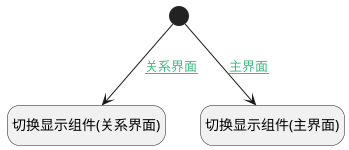

## 查看工单统计信息 <!-- {docsify-ignore-all} -->

   按钮触发，通过脚本切换显示组件

### 处理过程




### 处理步骤说明

#### 开始 :id=Begin<sup class="footnote-symbol"> <font color=gray size=1>[开始]</font></sup>


#### 切换显示组件(主界面) :id=RAWJSCODE1<sup class="footnote-symbol"> <font color=gray size=1>[直接前台代码]</font></sup>


<p class="panel-title"><b>执行代码</b></p>

```javascript
uiLogic.view.ctx.controllersMap.get("form").details.grouppanel8.state.visible=false;
uiLogic.view.ctx.controllersMap.get("form").details.grouppanel12.state.visible=true;
```

#### 切换显示组件(关系界面) :id=RAWJSCODE2<sup class="footnote-symbol"> <font color=gray size=1>[直接前台代码]</font></sup>


<p class="panel-title"><b>执行代码</b></p>

```javascript
uiLogic.view.ctx.parent.controllersMap.get("form").details.grouppanel8.state.visible=false;
uiLogic.view.ctx.parent.controllersMap.get("form").details.grouppanel12.state.visible=true;
```

### 连接条件说明
#### 主界面 :id=Begin-RAWJSCODE1

```ctx(上下文).target_type``` ISNULL
#### 关系界面 :id=Begin-RAWJSCODE2

```ctx(上下文).target_type``` ISNOTNULL


### 实体逻辑参数

|    中文名   |    代码名    |  数据类型      |备注 |
| --------| --------| --------  | --------   |
|上下文|ctx|导航视图参数绑定参数||
|当前视图对象|view|当前视图对象||
|传入变量(<i class="fa fa-check"/></i>)|Default|数据对象||
