## 选择需求模板 <!-- {docsify-ignore-all} -->

   选择需求模板后回填所选模板数据至表单

### 处理过程

```plantuml
@startuml
hide footbox
<style>
root {
  HyperlinkColor #42b983
}
</style>

hide empty description
state "开始" as Begin <<start>> [[$./choose_case_template#begin {开始}]]
state "结束" as END1 <<end>> [[$./choose_case_template#end1 {结束}]]
state "调试逻辑参数" as DEBUGPARAM1  [[$./choose_case_template#debugparam1 {调试逻辑参数}]]
state "绑定表单数据" as PREPAREJSPARAM1  [[$./choose_case_template#preparejsparam1 {绑定表单数据}]]
state "设置表单数据" as PREPAREJSPARAM2  [[$./choose_case_template#preparejsparam2 {设置表单数据}]]


Begin --> PREPAREJSPARAM1
PREPAREJSPARAM1 --> PREPAREJSPARAM2
PREPAREJSPARAM2 --> DEBUGPARAM1
DEBUGPARAM1 --> END1


@enduml
```

### 处理步骤说明

#### 开始 :id=Begin [开始]

#### 结束 :id=END1 [结束]

#### 绑定表单数据 :id=PREPAREJSPARAM1 [准备参数]

1. 将`form(表单).data` 绑定给  `form_data(表单数据)`

#### 设置表单数据 :id=PREPAREJSPARAM2 [准备参数]

1. 将`Default(传入变量).title` 设置给  `form_data(表单数据).title`
2. 将`Default(传入变量).category_name` 设置给  `form_data(表单数据).category_name`
3. 将`Default(传入变量).category_id` 设置给  `form_data(表单数据).category_id`
4. 将`Default(传入变量).description` 设置给  `form_data(表单数据).description`

#### 调试逻辑参数 :id=DEBUGPARAM1 [调试逻辑参数]

> [!NOTE|label:调试信息|icon:fa fa-bug]
> 调试输出参数`表单数据`的详细信息

### 实体逻辑参数

|    中文名   |    代码名    |  数据类型      |备注 |
| --------| --------| --------  | --------   |
|当前视图|view|当前视图对象||
|传入变量(<i class="fa fa-check"/></i>)|Default|数据对象||
|表单数据|form_data|数据对象||
|表单|form|部件对象||
