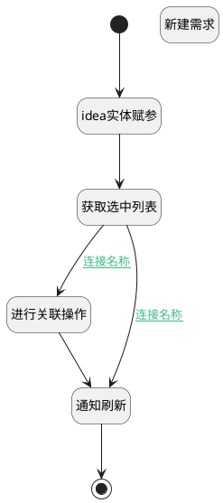

## 新建需求并关联客户 <!-- {docsify-ignore-all} -->

   

### 处理过程




### 处理步骤说明

#### 开始 :id=Begin<sup class="footnote-symbol"> <font color=gray size=1>[开始]</font></sup>


#### idea实体赋参 :id=PREPAREJSPARAM2<sup class="footnote-symbol"> <font color=gray size=1>[准备参数]</font></sup>


1. 将`Default(传入变量)` 设置给  `idea`

#### 新建需求 :id=create_idea<sup class="footnote-symbol"> <font color=gray size=1>[实体行为]</font></sup>


调用实体 [需求(IDEA)](module/ProdMgmt/idea.md) 行为 [Save](module/ProdMgmt/idea#行为) ，行为参数为`idea`

将执行结果返回给参数`idea`

#### 获取选中列表 :id=RAWJSCODE2<sup class="footnote-symbol"> <font color=gray size=1>[直接前台代码]</font></sup>


<p class="panel-title"><b>执行代码</b></p>

```javascript
let choose = uiLogic.default.customer_id;
if(choose != null && choose != ''){
    uiLogic.dto.srfactionparam = choose.split(',').map(id => ({ id }));
    uiLogic.dto.principal_id = uiLogic.idea.id;
    uiLogic.dto.id = uiLogic.idea.id;
    uiLogic.dto.principal_type = "idea";
    uiLogic.dto.target_type = "customer";
}
```

#### 进行关联操作 :id=DEACTION1<sup class="footnote-symbol"> <font color=gray size=1>[实体行为]</font></sup>


调用实体 [需求(IDEA)](module/ProdMgmt/idea.md) 行为 [其他实体关联需求(others_relation_idea)](module/ProdMgmt/idea#行为) ，行为参数为`dto(传入后台对象)`

#### 通知刷新 :id=RAWJSCODE3<sup class="footnote-symbol"> <font color=gray size=1>[直接前台代码]</font></sup>


<p class="panel-title"><b>执行代码</b></p>

```javascript

ibiz.mc.command.update.send({ srfdecodename: 'idea', srfkey: context.idea})
```

#### 结束 :id=END1<sup class="footnote-symbol"> <font color=gray size=1>[结束]</font></sup>


### 连接条件说明
#### 连接名称 :id=RAWJSCODE2-DEACTION1

```dto(传入后台对象).srfactionparam``` ISNOTNULL
#### 连接名称 :id=RAWJSCODE2-RAWJSCODE3

```dto(传入后台对象).srfactionparam``` ISNULL


### 实体逻辑参数

|    中文名   |    代码名    |  数据类型      |备注 |
| --------| --------| --------  | --------   |
|idea|idea|数据对象||
|视图对象|view|当前视图对象||
|传入后台对象|dto|数据对象||
|表单对象|form|部件对象||
|传入变量(<i class="fa fa-check"/></i>)|Default|数据对象||
