## 门户编辑 <!-- {docsify-ignore-all} -->

   所有门户部件配置该逻辑触发跳转至编辑页

### 处理过程

```plantuml
@startuml
hide footbox
<style>
root {
  HyperlinkColor #42b983
}
</style>

hide empty description
state "开始" as Begin <<start>> [[$./edit_to_design#begin {开始}]]
state "门户刷新" as RAWJSCODE2  [[$./edit_to_design#rawjscode2 {门户刷新}]]
state "结束" as END1 <<end>> [[$./edit_to_design#end1 {结束}]]
state "跳转设计页" as RAWJSCODE1  [[$./edit_to_design#rawjscode1 {跳转设计页}]]


Begin --> RAWJSCODE1
RAWJSCODE1 --> RAWJSCODE2
RAWJSCODE2 --> END1


@enduml
```




### 处理步骤说明

#### 开始 :id=Begin<sup class="footnote-symbol"> <font color=gray size=1>[开始]</font></sup>


#### 结束 :id=END1<sup class="footnote-symbol"> <font color=gray size=1>[结束]</font></sup>


#### 跳转设计页 :id=RAWJSCODE1<sup class="footnote-symbol"> <font color=gray size=1>[直接前台代码]</font></sup>


<p class="panel-title"><b>执行代码</b></p>

```javascript
const report_id = uiLogic.ctrl.model.id;
const prefix = "uxbireport__";
const remainingId = report_id.replace(prefix, '');
const newRemainingId = remainingId.replace(/__(?!__)/, '.');

const result = await ibiz.util.biReport.openDesignPage(context, params, { mode: 'DATA', reportId: newRemainingId });
return result;

```

#### 门户刷新 :id=RAWJSCODE2<sup class="footnote-symbol"> <font color=gray size=1>[直接前台代码]</font></sup>


<p class="panel-title"><b>执行代码</b></p>

```javascript
if (uiLogic.ctrl) {
uiLogic.ctrl.refresh();
}
```


### 实体逻辑参数

|    中文名   |    代码名    |  数据类型      |备注 |
| --------| --------| --------  | --------   |
|传入变量(<i class="fa fa-check"/></i>)|Default|数据对象||
|当前视图|view|当前视图对象||
|门户部件|ctrl|当前部件对象||
