## 获取客户分数 <!-- {docsify-ignore-all} -->

   获取客户分数

### 处理过程

```plantuml
@startuml
hide footbox
<style>
root {
  HyperlinkColor #42b983
}
</style>

hide empty description
state "开始" as Begin <<start>> [[$./get_customer_score#begin {开始}]]
state "获取分数" as DEACTION1  [[$./get_customer_score#deaction1 {获取分数}]]
state "注入脚本代码" as RAWJSCODE1  [[$./get_customer_score#rawjscode1 {注入脚本代码}]]
state "结果" as DEBUGPARAM1  [[$./get_customer_score#debugparam1 {结果}]]


Begin --> DEACTION1
DEACTION1 --> DEBUGPARAM1
DEBUGPARAM1 --> RAWJSCODE1


@enduml
```




### 处理步骤说明

#### 开始 :id=Begin<sup class="footnote-symbol"> <font color=gray size=1>[开始]</font></sup>


#### 获取分数 :id=DEACTION1<sup class="footnote-symbol"> <font color=gray size=1>[实体行为]</font></sup>


调用实体 [需求(IDEA)](module/ProdMgmt/idea.md) 行为 [获取客户分数(get_customer_score)](module/ProdMgmt/idea#行为) ，行为参数为`Default(传入变量)`

将执行结果返回给参数`result(结果)`

#### 结果 :id=DEBUGPARAM1<sup class="footnote-symbol"> <font color=gray size=1>[调试逻辑参数]</font></sup>


> [!NOTE|label:调试信息|icon:fa fa-bug]
> 调试输出参数`结果`的详细信息

#### 注入脚本代码 :id=RAWJSCODE1<sup class="footnote-symbol"> <font color=gray size=1>[直接前台代码]</font></sup>


<p class="panel-title"><b>执行代码</b></p>

```javascript
view.layoutPanel.panelItems.form.control.data.customer_score = uiLogic.result.customer_score
view.layoutPanel.panelItems.form.control.data.customer_score_precent = uiLogic.result.customer_score_precent
```


### 实体逻辑参数

|    中文名   |    代码名    |  数据类型      |备注 |
| --------| --------| --------  | --------   |
|视图|view|当前视图对象||
|传入变量(<i class="fa fa-check"/></i>)|Default|数据对象||
|结果|result|数据对象||
