## 获取工单数量 <!-- {docsify-ignore-all} -->

   获取工单数量

### 处理过程

```plantuml
@startuml
hide footbox
<style>
root {
  HyperlinkColor #42b983
}
</style>

hide empty description
state "开始" as Begin <<start>> [[$./get_ticket_num#begin {开始}]]
state "设置值至表单" as RAWJSCODE1  [[$./get_ticket_num#rawjscode1 {设置值至表单}]]
state "获取工单数量" as DEACTION1  [[$./get_ticket_num#deaction1 {获取工单数量}]]


Begin --> DEACTION1
DEACTION1 --> RAWJSCODE1


@enduml
```




### 处理步骤说明

#### 开始 :id=Begin<sup class="footnote-symbol"> <font color=gray size=1>[开始]</font></sup>


#### 获取工单数量 :id=DEACTION1<sup class="footnote-symbol"> <font color=gray size=1>[实体行为]</font></sup>


调用实体 [需求(IDEA)](module/ProdMgmt/idea.md) 行为 [获取工单数量(get_ticket_num)](module/ProdMgmt/idea#行为) ，行为参数为`Default(传入变量)`

将执行结果返回给参数`result(结果)`

#### 设置值至表单 :id=RAWJSCODE1<sup class="footnote-symbol"> <font color=gray size=1>[直接前台代码]</font></sup>


<p class="panel-title"><b>执行代码</b></p>

```javascript
let count_num = uiLogic.result.count_num
let sum_num = uiLogic.result.sum_num
if (count_num == '' || count_num == 0) {
    view.layoutPanel.panelItems.form.control.data.ticket_num = '0/0'
    view.layoutPanel.panelItems.form.control.data.ticket_num_percent = 0
} else {
    view.layoutPanel.panelItems.form.control.data.ticket_num = sum_num + '/' + count_num
    view.layoutPanel.panelItems.form.control.data.ticket_num_percent = sum_num / count_num
}
```


### 实体逻辑参数

|    中文名   |    代码名    |  数据类型      |备注 |
| --------| --------| --------  | --------   |
|传入变量(<i class="fa fa-check"/></i>)|Default|数据对象||
|视图|view|当前视图对象||
|结果|result|数据对象||
