## 需求展示评论显隐控制 <!-- {docsify-ignore-all} -->

   

### 处理过程

```plantuml
@startuml
hide footbox
<style>
root {
  HyperlinkColor #42b983
}
</style>

hide empty description
state "开始" as Begin <<start>> [[$./idea_comment_visible#begin {开始}]]
state "评论显隐控制" as RAWJSCODE1  [[$./idea_comment_visible#rawjscode1 {评论显隐控制}]]
state "结束" as END1 <<end>> [[$./idea_comment_visible#end1 {结束}]]


Begin --> RAWJSCODE1
RAWJSCODE1 --> END1


@enduml
```




### 处理步骤说明

#### 开始 :id=Begin<sup class="footnote-symbol"> <font color=gray size=1>[开始]</font></sup>


#### 结束 :id=END1<sup class="footnote-symbol"> <font color=gray size=1>[结束]</font></sup>


#### 评论显隐控制 :id=RAWJSCODE1<sup class="footnote-symbol"> <font color=gray size=1>[直接前台代码]</font></sup>


<p class="panel-title"><b>执行代码</b></p>

```javascript
if (uiLogic.view.layoutPanel.panelItems.list.control.state.items.length==0){
    uiLogic.view.parentView.layoutPanel.panelItems.form.control.details.grouppanel3.state.visible=false
}
```


### 实体逻辑参数

|    中文名   |    代码名    |  数据类型      |备注 |
| --------| --------| --------  | --------   |
|传入变量(<i class="fa fa-check"/></i>)|Default|数据对象||
|view|view|当前视图对象||
