## 组件显隐重置 <!-- {docsify-ignore-all} -->

   

### 处理过程

```plantuml
@startuml
hide footbox
<style>
root {
  HyperlinkColor #42b983
}
</style>

hide empty description
state "开始" as Begin <<start>> [[$./reset#begin {开始}]]
state "注入脚本代码" as RAWJSCODE1  [[$./reset#rawjscode1 {注入脚本代码}]]
state "准备参数" as PREPAREJSPARAM1  [[$./reset#preparejsparam1 {准备参数}]]
state "视图部件调用" as VIEWCTRLINVOKE1  [[$./reset#viewctrlinvoke1 {视图部件调用}]]


Begin --> PREPAREJSPARAM1
PREPAREJSPARAM1 --> VIEWCTRLINVOKE1
VIEWCTRLINVOKE1 --> RAWJSCODE1


@enduml
```




### 处理步骤说明

#### 开始 :id=Begin<sup class="footnote-symbol"> <font color=gray size=1>[开始]</font></sup>


#### 准备参数 :id=PREPAREJSPARAM1<sup class="footnote-symbol"> <font color=gray size=1>[准备参数]</font></sup>


1. 将`view(当前视图对象).layoutPanel.panelItems.form.control` 设置给  `form(指定部件对象)`

#### 视图部件调用 :id=VIEWCTRLINVOKE1<sup class="footnote-symbol"> <font color=gray size=1>[视图部件调用]</font></sup>


调用`form(指定部件对象)`的方法`load`，参数为`form(指定部件对象)`
#### 注入脚本代码 :id=RAWJSCODE1<sup class="footnote-symbol"> <font color=gray size=1>[直接前台代码]</font></sup>


<p class="panel-title"><b>执行代码</b></p>

```javascript
uiLogic.view.ctx.controllersMap.get("form").details.grouppanel8.state.visible=true;
uiLogic.view.ctx.controllersMap.get("form").details.version.state.visible=false;
```


### 实体逻辑参数

|    中文名   |    代码名    |  数据类型      |备注 |
| --------| --------| --------  | --------   |
|传入变量(<i class="fa fa-check"/></i>)|Default|数据对象||
|当前视图对象|view|当前视图对象||
|指定部件对象|form|部件对象||
