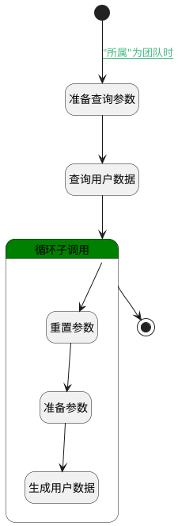

## 自动创建人员 <!-- {docsify-ignore-all} -->

   当所属选择"团队"时，点击完成后自动添加团队下的所有成员。

### 处理过程




### 处理步骤说明

#### 开始 :id=Begin<sup class="footnote-symbol"> <font color=gray size=1>[开始]</font></sup>


*- N/A*
#### 准备查询参数 :id=PREPAREPARAM2<sup class="footnote-symbol"> <font color=gray size=1>[准备参数]</font></sup>


1. 将`Default(传入变量).SCOPE_ID(所属对象)` 设置给  `member(用户信息).n_owner_id_eq`
2. 将`GROUP` 设置给  `member(用户信息).n_owner_type_eq`

#### 查询用户数据 :id=DEDATASET1<sup class="footnote-symbol"> <font color=gray size=1>[实体数据集]</font></sup>


调用实体 [成员(MEMBER)](module/Base/member.md) 数据集合 [数据集(DEFAULT)](module/Base/member#数据集合) ，查询参数为`member(用户信息)`

将执行结果返回给参数`member_page(用户分页结果数据)`

#### 循环子调用 :id=LOOPSUBCALL1<sup class="footnote-symbol"> <font color=gray size=1>[循环子调用]</font></sup>


循环参数`member_page(用户分页结果数据)`，子循环参数使用`member_obj(用户结果变量)`
#### 重置参数 :id=RESETPARAM1<sup class="footnote-symbol"> <font color=gray size=1>[重置参数]</font></sup>


重置参数```product_member(成员参数)```
#### 准备参数 :id=PREPAREPARAM4<sup class="footnote-symbol"> <font color=gray size=1>[准备参数]</font></sup>


1. 将`Default(传入变量).ID(标识)` 设置给  `product_member(成员参数).PRODUCT_ID(产品标识)`
2. 将`member_obj(用户结果变量).NAME(名称)` 设置给  `product_member(成员参数).NAME(姓名)`
3. 将`member_obj(用户结果变量).USER_ID(登录名)` 设置给  `product_member(成员参数).USER_ID(登录名)`
4. 将`member_obj(用户结果变量).ROLE_ID(角色)` 设置给  `product_member(成员参数).ROLE_ID(角色)`

#### 生成用户数据 :id=DEACTION3<sup class="footnote-symbol"> <font color=gray size=1>[实体行为]</font></sup>


调用实体 [产品成员(PRODUCT_MEMBER)](module/ProdMgmt/product_member.md) 行为 [Create](module/ProdMgmt/product_member#行为) ，行为参数为`product_member(成员参数)`

#### 结束 :id=END1<sup class="footnote-symbol"> <font color=gray size=1>[结束]</font></sup>


*- N/A*


### 连接条件说明
#### "所属"为团队时 :id=Begin-PREPAREPARAM2

`Default(传入变量).SCOPE_TYPE(所属)` EQ `user_group`


### 实体逻辑参数

|    中文名   |    代码名    |  数据类型    |  实体   |备注 |
| --------| --------| -------- | -------- | --------   |
|传入变量(<i class="fa fa-check"/></i>)|Default|数据对象|[产品(PRODUCT)](module/ProdMgmt/product.md)||
|用户信息|member|过滤器|||
|用户结果变量|member_obj|数据对象|[成员(MEMBER)](module/Base/member.md)||
|用户分页结果数据|member_page|分页查询|||
|成员参数|product_member|数据对象|[产品成员(PRODUCT_MEMBER)](module/ProdMgmt/product_member.md)||
