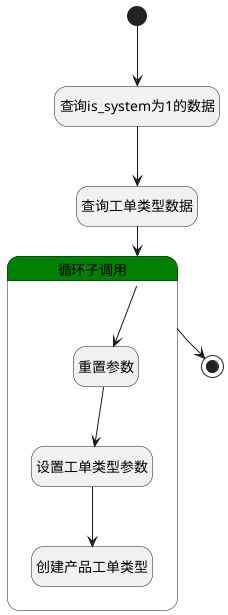

## 生成产品工单类型 <!-- {docsify-ignore-all} -->

   产品建立时将工单类型中is_system=1的数据同步至产品工单类型中

### 处理过程




### 处理步骤说明

#### 开始 :id=Begin<sup class="footnote-symbol"> <font color=gray size=1>[开始]</font></sup>


*- N/A*
#### 查询is_system为1的数据 :id=PREPAREPARAM3<sup class="footnote-symbol"> <font color=gray size=1>[准备参数]</font></sup>


1. 将`1` 设置给  `ticket_type_filter(工单类型过滤器).n_is_system_eq`

#### 查询工单类型数据 :id=DEDATASET1<sup class="footnote-symbol"> <font color=gray size=1>[实体数据集]</font></sup>


调用实体 [工单类型(TICKET_TYPE)](module/ProdMgmt/ticket_type.md) 数据集合 [数据集(DEFAULT)](module/ProdMgmt/ticket_type#数据集合) ，查询参数为`ticket_type_filter(工单类型过滤器)`

将执行结果返回给参数`ticket_type_page(工单类型分页结果)`

#### 循环子调用 :id=LOOPSUBCALL1<sup class="footnote-symbol"> <font color=gray size=1>[循环子调用]</font></sup>


循环参数`ticket_type_page(工单类型分页结果)`，子循环参数使用`ticket_type_obj(工单类型变量)`
#### 重置参数 :id=RESETPARAM1<sup class="footnote-symbol"> <font color=gray size=1>[重置参数]</font></sup>


重置参数```product_ticket_param(产品工单类型变量)```
#### 设置工单类型参数 :id=PREPAREPARAM2<sup class="footnote-symbol"> <font color=gray size=1>[准备参数]</font></sup>


1. 将`ticket_type_obj(工单类型变量).ID(标识)` 设置给  `product_ticket_param(产品工单类型变量).TICKET_TYPE_ID(工单类型标识)`
2. 将`Default(传入变量).ID(标识)` 设置给  `product_ticket_param(产品工单类型变量).PRODUCT_ID(产品标识)`

#### 创建产品工单类型 :id=DEACTION2<sup class="footnote-symbol"> <font color=gray size=1>[实体行为]</font></sup>


调用实体 [产品工单类型(PRODUCT_TICKET_TYPE)](module/ProdMgmt/product_ticket_type.md) 行为 [Create](module/ProdMgmt/product_ticket_type#行为) ，行为参数为`product_ticket_param(产品工单类型变量)`

#### 结束 :id=END1<sup class="footnote-symbol"> <font color=gray size=1>[结束]</font></sup>


*- N/A*


### 实体逻辑参数

|    中文名   |    代码名    |  数据类型    |  实体   |备注 |
| --------| --------| -------- | -------- | --------   |
|传入变量(<i class="fa fa-check"/></i>)|Default|数据对象|[产品(PRODUCT)](module/ProdMgmt/product.md)||
|产品工单类型变量|product_ticket_param|数据对象|[产品工单类型(PRODUCT_TICKET_TYPE)](module/ProdMgmt/product_ticket_type.md)||
|最近访问数据|recent|数据对象|[最近访问(RECENT)](module/Base/recent.md)||
|工单类型过滤器|ticket_type_filter|过滤器|||
|工单类型变量|ticket_type_obj|数据对象|[工单类型(TICKET_TYPE)](module/ProdMgmt/ticket_type.md)||
|工单类型分页结果|ticket_type_page|分页查询|||
