## 生成最近访问 <!-- {docsify-ignore-all} -->

   在用户对产品数据进行了get或update操作时生成相应的访问记录

### 处理过程

```plantuml
@startuml
hide empty description
<style>
root {
  HyperlinkColor #42b983
}
</style>

hide empty description
state "开始" as Begin <<start>> [[$./create_recent#begin {"开始"}]]
state "准备最近访问参数" as PREPAREPARAM1  [[$./create_recent#prepareparam1 {"准备最近访问参数"}]]
state "保存最近访问" as DEACTION1  [[$./create_recent#deaction1 {"保存最近访问"}]]
state "结束" as END1 <<end>> [[$./create_recent#end1 {"结束"}]]


Begin --> PREPAREPARAM1
PREPAREPARAM1 --> DEACTION1
DEACTION1 --> END1


@enduml
```

### 处理步骤说明

#### 开始 :id=Begin [开始]

*- N/A*
#### 准备最近访问参数 :id=PREPAREPARAM1 [准备参数]

1. 将`Default(传入变量).ID(标识)` 设置给  `recent(最近访问数据).OWNER_ID(所属数据标识)`
2. 将`Default(传入变量).IDENTIFIER(产品标识)` 设置给  `recent(最近访问数据).RECENT_PARENT_IDENTIFIER(访问父类编号)`
3. 将`Default(传入变量).NAME(产品名称)` 设置给  `recent(最近访问数据).RECENT_PARENT_NAME(访问父类名称)`
4. 将`Default(传入变量).ID(标识)` 设置给  `recent(最近访问数据).RECENT_PARENT(访问父类)`
5. 将`用户全局对象.srfpersonid` 设置给  `recent(最近访问数据).CREATE_MAN(建立人)`
6. 将`1` 设置给  `recent(最近访问数据).TYPE(访问类型)`
7. 将`Default(传入变量).NAME(产品名称)` 设置给  `recent(最近访问数据).NAME(名称)`
8. 将`product` 设置给  `recent(最近访问数据).OWNER_TYPE(所属数据对象)`
9. 将`product` 设置给  `recent(最近访问数据).OWNER_SUBTYPE(所属对象子类型)`

#### 保存最近访问 :id=DEACTION1 [实体行为]

调用实体 [最近访问(RECENT)](module/Base/recent.md) 行为 [Save](module/Base/recent#行为) ，行为参数为`recent(最近访问数据)`

#### 结束 :id=END1 [结束]

*- N/A*

### 实体逻辑参数

|    中文名   |    代码名    |  数据类型    |  实体   |备注 |
| --------| --------| -------- | -------- | --------   |
|传入变量(<i class="fa fa-check"/></i>)|Default|数据对象|[产品(PRODUCT)](module/ProdMgmt/product.md)||
|产品工单类型变量|product_ticket_param|数据对象|[产品工单类型(PRODUCT_TICKET_TYPE)](module/ProdMgmt/product_ticket_type.md)||
|最近访问数据|recent|数据对象|[最近访问(RECENT)](module/Base/recent.md)||
|工单类型过滤器|ticket_type_filter|过滤器|||
|工单类型变量|ticket_type_obj|数据对象|[工单类型(TICKET_TYPE)](module/ProdMgmt/ticket_type.md)||
|工单类型分页结果|ticket_type_page|分页查询|||
