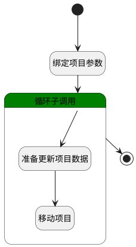

## 产品移动 <!-- {docsify-ignore-all} -->

   产品更多设置中移动产品

### 处理过程

### 处理步骤说明

#### 开始 :id=Begin [开始]

*- N/A*
#### 绑定项目参数 :id=BINDPARAM1 [绑定参数]

绑定参数`Default(传入变量)` 到 `srfactionparam`
#### 循环子调用 :id=LOOPSUBCALL1 [循环子调用]

循环参数`srfactionparam`，子循环参数使用`for_temp_obj(循环临时变量)`
#### 准备更新项目数据 :id=PREPAREPARAM1 [准备参数]

1. 将`for_temp_obj(循环临时变量).VISIBILITY(可见范围)` 设置给  `update_obj.VISIBILITY(可见范围)`
2. 将`for_temp_obj(循环临时变量).SCOPE_ID(所属对象)` 设置给  `update_obj.SCOPE_ID(所属对象)`
3. 将`for_temp_obj(循环临时变量).SCOPE_TYPE(所属)` 设置给  `update_obj.SCOPE_TYPE(所属)`
4. 将`Default(传入变量).ID(标识)` 设置给  `update_obj.ID(标识)`

#### 移动项目 :id=DEACTION1 [实体行为]

调用实体 [产品(PRODUCT)](module/ProdMgmt/product.md) 行为 [Update](module/ProdMgmt/product#行为) ，行为参数为`update_obj`

#### 结束 :id=END1 [结束]

*- N/A*

### 实体逻辑参数

|    中文名   |    代码名    |  数据类型    |  实体   |备注 |
| --------| --------| -------- | -------- | --------   |
|传入变量(<i class="fa fa-check"/></i>)|Default|数据对象|[产品(PRODUCT)](module/ProdMgmt/product.md)||
|循环临时变量|for_temp_obj|数据对象|[产品(PRODUCT)](module/ProdMgmt/product.md)||
|srfactionparam|srfactionparam|数据对象列表|[产品(PRODUCT)](module/ProdMgmt/product.md)||
|update_obj|update_obj|数据对象|[产品(PRODUCT)](module/ProdMgmt/product.md)||
