## 获取表格当前页大小 <!-- {docsify-ignore-all} -->

   

### 处理过程

```plantuml
@startuml
hide footbox
<style>
root {
  HyperlinkColor #42b983
}
</style>

hide empty description
state "开始" as Begin <<start>> [[$./get_table_size#begin {开始}]]
state "结束" as END1 <<end>> [[$./get_table_size#end1 {结束}]]
state "设置总条数" as RAWJSCODE1  [[$./get_table_size#rawjscode1 {设置总条数}]]


Begin --> RAWJSCODE1
RAWJSCODE1 --> END1


@enduml
```




### 处理步骤说明

#### 开始 :id=Begin<sup class="footnote-symbol"> <font color=gray size=1>[开始]</font></sup>


#### 结束 :id=END1<sup class="footnote-symbol"> <font color=gray size=1>[结束]</font></sup>


#### 设置总条数 :id=RAWJSCODE1<sup class="footnote-symbol"> <font color=gray size=1>[直接前台代码]</font></sup>


<p class="panel-title"><b>执行代码</b></p>

```javascript
const total = uiLogic.ctrl.state.items.length;
uiLogic.view.layoutPanel.state.data.total = total;
```


### 实体逻辑参数

|    中文名   |    代码名    |  数据类型      |备注 |
| --------| --------| --------  | --------   |
|当前视图对象|VIEW|当前视图对象||
|传入变量(<i class="fa fa-check"/></i>)|Default|数据对象||
|当前部件对象|CTRL|当前部件对象||
