## 产品关联空间 <!-- {docsify-ignore-all} -->

   

### 处理过程

```plantuml
@startuml
hide footbox
<style>
root {
  HyperlinkColor #42b983
}
</style>

hide empty description
state "开始" as Begin <<start>> [[$./product__re_space#begin {开始}]]
state "准备参数" as PREPAREJSPARAM1  [[$./product__re_space#preparejsparam1 {准备参数}]]
state "实体行为" as DEACTION1  [[$./product__re_space#deaction1 {实体行为}]]
state "结束" as END1 <<end>> [[$./product__re_space#end1 {结束}]]
state "调试逻辑参数" as DEBUGPARAM1  [[$./product__re_space#debugparam1 {调试逻辑参数}]]


Begin --> PREPAREJSPARAM1
PREPAREJSPARAM1 --> DEBUGPARAM1
DEBUGPARAM1 --> DEACTION1
DEACTION1 --> END1


@enduml
```

### 处理步骤说明

#### 开始 :id=Begin [开始]

#### 结束 :id=END1 [结束]

#### 准备参数 :id=PREPAREJSPARAM1 [准备参数]

1. 将`ctx(上下文参数).target_type` 设置给  `Default(传入变量).target_type`
2. 将`ctx(上下文参数).principal_type` 设置给  `Default(传入变量).principal_type`

#### 调试逻辑参数 :id=DEBUGPARAM1 [调试逻辑参数]

> [!NOTE|label:调试信息|icon:fa fa-bug]
> 调试输出参数`传入变量`的详细信息

#### 实体行为 :id=DEACTION1 [实体行为]

调用实体 [产品(PRODUCT)](module/ProdMgmt/product.md) 行为 [其他实体关联空间(other_re_space)](module/ProdMgmt/product#行为) ，行为参数为`Default(传入变量)`

### 实体逻辑参数

|    中文名   |    代码名    |  数据类型      |备注 |
| --------| --------| --------  | --------   |
|上下文参数|ctx|导航视图参数绑定参数||
|传入变量(<i class="fa fa-check"/></i>)|Default|数据对象||
