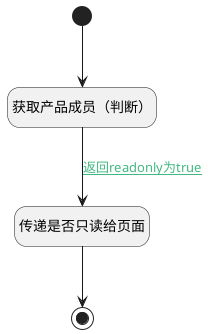

## 产品只读用户判断 <!-- {docsify-ignore-all} -->

   判断当前用户是否为只读用户，调用后台处理逻辑获取当前产品成员并判断返回

### 处理过程




### 处理步骤说明

#### 开始 :id=Begin<sup class="footnote-symbol"> <font color=gray size=1>[开始]</font></sup>


#### 获取产品成员（判断） :id=DEACTION1<sup class="footnote-symbol"> <font color=gray size=1>[实体行为]</font></sup>


调用实体 [产品(PRODUCT)](module/ProdMgmt/product.md) 行为 [产品只读用户判断(product_readonly_recognize)](module/ProdMgmt/product#行为) ，行为参数为`Default(传入变量)`

将执行结果返回给参数`Default(传入变量)`

#### 传递是否只读给页面 :id=PREPAREJSPARAM2<sup class="footnote-symbol"> <font color=gray size=1>[准备参数]</font></sup>


1. 将`true` 设置给  `view.context.srfreadonly`

#### 结束 :id=END1<sup class="footnote-symbol"> <font color=gray size=1>[结束]</font></sup>


### 连接条件说明
#### 返回readonly为true :id=DEACTION1-PREPAREJSPARAM2

```Default(传入变量).srfreadonly``` EQ ```0```


### 实体逻辑参数

|    中文名   |    代码名    |  数据类型      |备注 |
| --------| --------| --------  | --------   |
|表单|form|部件对象||
|视图参数|view_params|数据对象||
|成员信息|members|分页查询||
|传入变量(<i class="fa fa-check"/></i>)|Default|数据对象||
|view|view|当前视图对象||
|上下文|viewctx|导航视图参数绑定参数||
