## 建立产品成员 <!-- {docsify-ignore-all} -->

   根据表格选中数据，生成产品成员

### 处理过程

```plantuml
@startuml
hide footbox
<style>
root {
  HyperlinkColor #42b983
}
</style>

hide empty description
state "开始" as Begin <<start>> [[$./create_product_member#begin {开始}]]
state "生成产品成员" as DEACTION1  [[$./create_product_member#deaction1 {生成产品成员}]]
state "关闭选择视图" as VIEWCTRLINVOKE1  [[$./create_product_member#viewctrlinvoke1 {关闭选择视图}]]
state "获取选中数据" as RAWJSCODE1  [[$./create_product_member#rawjscode1 {获取选中数据}]]
state "准备参数" as PREPAREJSPARAM1  [[$./create_product_member#preparejsparam1 {准备参数}]]


Begin --> RAWJSCODE1
RAWJSCODE1 --> PREPAREJSPARAM1
PREPAREJSPARAM1 --> DEACTION1
DEACTION1 --> VIEWCTRLINVOKE1


@enduml
```




### 处理步骤说明

#### 开始 :id=Begin<sup class="footnote-symbol"> <font color=gray size=1>[开始]</font></sup>


#### 获取选中数据 :id=RAWJSCODE1<sup class="footnote-symbol"> <font color=gray size=1>[直接前台代码]</font></sup>


<p class="panel-title"><b>执行代码</b></p>

```javascript
let selecteddata=uiLogic.view.ctx.controllersMap.get("user_pickupgridview_user").ctx.controllersMap.get("grid").state.selectedData;
if (selecteddata.length > 0) {
    uiLogic.temp_obj.selectdata = selecteddata;
}
```

#### 准备参数 :id=PREPAREJSPARAM1<sup class="footnote-symbol"> <font color=gray size=1>[准备参数]</font></sup>


1. 将`ctx(应用上下文参数).product` 设置给  `temp_obj(临时变量).product_id`

#### 生成产品成员 :id=DEACTION1<sup class="footnote-symbol"> <font color=gray size=1>[实体行为]</font></sup>


调用实体 [产品成员(PRODUCT_MEMBER)](module/ProdMgmt/product_member.md) 行为 [新建产品成员(create_product_member)](module/ProdMgmt/product_member#行为) ，行为参数为`temp_obj(临时变量)`

#### 关闭选择视图 :id=VIEWCTRLINVOKE1<sup class="footnote-symbol"> <font color=gray size=1>[视图部件调用]</font></sup>


调用`view(当前视图)`的方法`closeView`，参数为`Default(传入变量)`


### 实体逻辑参数

|    中文名   |    代码名    |  数据类型      |备注 |
| --------| --------| --------  | --------   |
|应用上下文参数|ctx|导航视图参数绑定参数||
|传入变量(<i class="fa fa-check"/></i>)|Default|数据对象||
|当前视图|view|当前视图对象||
|临时变量|temp_obj|数据对象||
