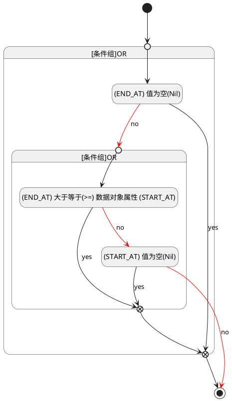

## 计划结束(END_AT) <!-- {docsify-ignore-all} -->

   

### 结束时间 :id=END_AT

```plantuml
@startuml
hide empty description
<style>
root {
  HyperlinkColor #42b983
}
</style>

state "start" as start  <<start>>
state "end" as end <<end>>
state "[条件组]OR" as 060a5320fea4382a942898801b3ef9f5 [[$./end_at#a060a5320fea4382a942898801b3ef9f5 {"[条件组]OR"}]] {
state " " as 060a5320fea4382a942898801b3ef9f5_entry  <<entryPoint>>
state "(END_AT) 值为空(Nil)" as 84a9c49a4c4b7dde9066fd9432855e0c [[$./end_at#a84a9c49a4c4b7dde9066fd9432855e0c {"[常规条件] 值为空(Nil)"}]]
state "[条件组]OR" as 5e7d0125df31772a5c041e84b3b375de [[$./end_at#a5e7d0125df31772a5c041e84b3b375de {"[条件组]OR"}]] {
state " " as 5e7d0125df31772a5c041e84b3b375de_entry  <<entryPoint>>
state "(END_AT) 大于等于(>=) 数据对象属性 (START_AT)" as b7aa87021d6429a7b208a95f0290ee40 [[$./end_at#ab7aa87021d6429a7b208a95f0290ee40 {"[常规条件] 大于等于(>=) 数据对象属性 (START_AT)"}]]
state "(START_AT) 值为空(Nil)" as aa7efbc2d83063defeffda99eae8f6d7 [[$./end_at#aaa7efbc2d83063defeffda99eae8f6d7 {"[常规条件] 值为空(Nil)"}]]
state " " as 5e7d0125df31772a5c041e84b3b375de_exit  <<exitPoint>>
}
state " " as 060a5320fea4382a942898801b3ef9f5_exit  <<exitPoint>>
}


start --> 060a5320fea4382a942898801b3ef9f5_entry 
060a5320fea4382a942898801b3ef9f5_entry --> 84a9c49a4c4b7dde9066fd9432855e0c 
84a9c49a4c4b7dde9066fd9432855e0c --> 060a5320fea4382a942898801b3ef9f5_exit  : yes
84a9c49a4c4b7dde9066fd9432855e0c -[#red]-> 5e7d0125df31772a5c041e84b3b375de_entry  : no

5e7d0125df31772a5c041e84b3b375de_entry --> b7aa87021d6429a7b208a95f0290ee40 
b7aa87021d6429a7b208a95f0290ee40 --> 5e7d0125df31772a5c041e84b3b375de_exit  : yes
b7aa87021d6429a7b208a95f0290ee40 -[#red]-> aa7efbc2d83063defeffda99eae8f6d7  : no

aa7efbc2d83063defeffda99eae8f6d7 --> 5e7d0125df31772a5c041e84b3b375de_exit  : yes
aa7efbc2d83063defeffda99eae8f6d7 -[#red]-> end  : no
5e7d0125df31772a5c041e84b3b375de_exit --> 060a5320fea4382a942898801b3ef9f5_exit 
060a5320fea4382a942898801b3ef9f5_exit --> end 


@enduml
```

#### 条件说明

##### (END_AT) 值为空(Nil) :id=a84a9c49a4c4b7dde9066fd9432855e0c

`END_AT(计划结束)` ISNULL 

##### (START_AT) 值为空(Nil) :id=aaa7efbc2d83063defeffda99eae8f6d7

`START_AT(计划开始)` ISNULL 

##### (END_AT) 大于等于(>=) 数据对象属性 (START_AT) :id=ab7aa87021d6429a7b208a95f0290ee40

`END_AT(计划结束)` GTANDEQ  `START_AT`

> [!ATTENTION|label:规则信息|icon:fa fa-warning]
> 发布时间必须大于等于开始时间

