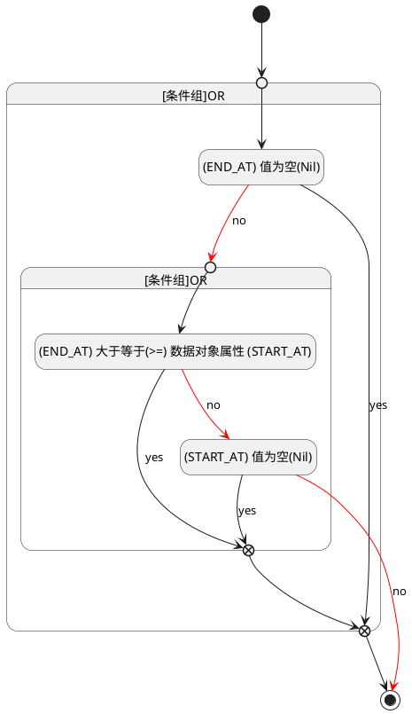

## 计划结束(END_AT) <!-- {docsify-ignore-all} -->

   

### 结束时间 :id=END_AT

```plantuml
@startuml
hide empty description
<style>
root {
  HyperlinkColor #42b983
}
</style>

state "start" as start  <<start>>
state "end" as end <<end>>
state "[条件组]OR" as f0d8720e6140c340d48d877fcc850e56 [[$./end_at#af0d8720e6140c340d48d877fcc850e56 {"[条件组]OR"}]] {
state " " as f0d8720e6140c340d48d877fcc850e56_entry  <<entryPoint>>
state "(END_AT) 值为空(Nil)" as 296c206288c83775c60931ab4a246200 [[$./end_at#a296c206288c83775c60931ab4a246200 {"[常规条件] 值为空(Nil)"}]]
state "[条件组]OR" as 1c10c23f5275f1992d1856101eb10e2c [[$./end_at#a1c10c23f5275f1992d1856101eb10e2c {"[条件组]OR"}]] {
state " " as 1c10c23f5275f1992d1856101eb10e2c_entry  <<entryPoint>>
state "(END_AT) 大于等于(>=) 数据对象属性 (START_AT)" as 8a91a1c501402f0c037538eeb4eb8c13 [[$./end_at#a8a91a1c501402f0c037538eeb4eb8c13 {"[常规条件] 大于等于(>=) 数据对象属性 (START_AT)"}]]
state "(START_AT) 值为空(Nil)" as 0bbe2fd6c09f2c59c312319cfb3663c5 [[$./end_at#a0bbe2fd6c09f2c59c312319cfb3663c5 {"[常规条件] 值为空(Nil)"}]]
state " " as 1c10c23f5275f1992d1856101eb10e2c_exit  <<exitPoint>>
}
state " " as f0d8720e6140c340d48d877fcc850e56_exit  <<exitPoint>>
}


start --> f0d8720e6140c340d48d877fcc850e56_entry 
f0d8720e6140c340d48d877fcc850e56_entry --> 296c206288c83775c60931ab4a246200 
296c206288c83775c60931ab4a246200 --> f0d8720e6140c340d48d877fcc850e56_exit  : yes
296c206288c83775c60931ab4a246200 -[#red]-> 1c10c23f5275f1992d1856101eb10e2c_entry  : no

1c10c23f5275f1992d1856101eb10e2c_entry --> 8a91a1c501402f0c037538eeb4eb8c13 
8a91a1c501402f0c037538eeb4eb8c13 --> 1c10c23f5275f1992d1856101eb10e2c_exit  : yes
8a91a1c501402f0c037538eeb4eb8c13 -[#red]-> 0bbe2fd6c09f2c59c312319cfb3663c5  : no

0bbe2fd6c09f2c59c312319cfb3663c5 --> 1c10c23f5275f1992d1856101eb10e2c_exit  : yes
0bbe2fd6c09f2c59c312319cfb3663c5 -[#red]-> end  : no
1c10c23f5275f1992d1856101eb10e2c_exit --> f0d8720e6140c340d48d877fcc850e56_exit 
f0d8720e6140c340d48d877fcc850e56_exit --> end 


@enduml
```

#### 条件说明

##### (END_AT) 大于等于(>=) 数据对象属性 (START_AT) :id=a8a91a1c501402f0c037538eeb4eb8c13

`END_AT(计划结束)` GTANDEQ  `START_AT`

> [!ATTENTION|label:规则信息|icon:fa fa-warning]
> 发布时间必须大于等于开始时间

##### (START_AT) 值为空(Nil) :id=a0bbe2fd6c09f2c59c312319cfb3663c5

`START_AT(计划开始)` ISNULL 

##### (END_AT) 值为空(Nil) :id=a296c206288c83775c60931ab4a246200

`END_AT(计划结束)` ISNULL 

