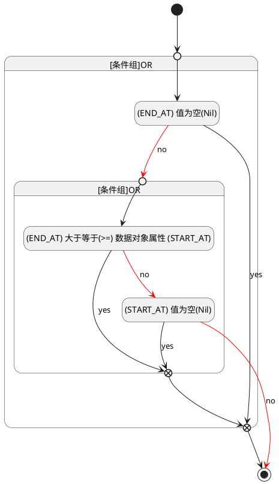

## 计划结束(END_AT) <!-- {docsify-ignore-all} -->

   

### 结束时间 :id=END_AT

```plantuml
@startuml
hide empty description
<style>
root {
  HyperlinkColor #42b983
}
</style>

state "start" as start  <<start>>
state "end" as end <<end>>
state "[条件组]OR" as e8e075bf5ab0847260c2d2198a36a0e9 [[$./end_at#ae8e075bf5ab0847260c2d2198a36a0e9 {"[条件组]OR"}]] {
state " " as e8e075bf5ab0847260c2d2198a36a0e9_entry  <<entryPoint>>
state "(END_AT) 值为空(Nil)" as e74acc7a99d61e6a1264b319376fbe6c [[$./end_at#ae74acc7a99d61e6a1264b319376fbe6c {"[常规条件] 值为空(Nil)"}]]
state "[条件组]OR" as 04916e0eed120ee22f4139761a60ad68 [[$./end_at#a04916e0eed120ee22f4139761a60ad68 {"[条件组]OR"}]] {
state " " as 04916e0eed120ee22f4139761a60ad68_entry  <<entryPoint>>
state "(END_AT) 大于等于(>=) 数据对象属性 (START_AT)" as 0dc82efc759990da2c6eb88758277b09 [[$./end_at#a0dc82efc759990da2c6eb88758277b09 {"[常规条件] 大于等于(>=) 数据对象属性 (START_AT)"}]]
state "(START_AT) 值为空(Nil)" as e3adf5efff78db00963c012b26c2798a [[$./end_at#ae3adf5efff78db00963c012b26c2798a {"[常规条件] 值为空(Nil)"}]]
state " " as 04916e0eed120ee22f4139761a60ad68_exit  <<exitPoint>>
}
state " " as e8e075bf5ab0847260c2d2198a36a0e9_exit  <<exitPoint>>
}


start --> e8e075bf5ab0847260c2d2198a36a0e9_entry 
e8e075bf5ab0847260c2d2198a36a0e9_entry --> e74acc7a99d61e6a1264b319376fbe6c 
e74acc7a99d61e6a1264b319376fbe6c --> e8e075bf5ab0847260c2d2198a36a0e9_exit  : yes
e74acc7a99d61e6a1264b319376fbe6c -[#red]-> 04916e0eed120ee22f4139761a60ad68_entry  : no

04916e0eed120ee22f4139761a60ad68_entry --> 0dc82efc759990da2c6eb88758277b09 
0dc82efc759990da2c6eb88758277b09 --> 04916e0eed120ee22f4139761a60ad68_exit  : yes
0dc82efc759990da2c6eb88758277b09 -[#red]-> e3adf5efff78db00963c012b26c2798a  : no

e3adf5efff78db00963c012b26c2798a --> 04916e0eed120ee22f4139761a60ad68_exit  : yes
e3adf5efff78db00963c012b26c2798a -[#red]-> end  : no
04916e0eed120ee22f4139761a60ad68_exit --> e8e075bf5ab0847260c2d2198a36a0e9_exit 
e8e075bf5ab0847260c2d2198a36a0e9_exit --> end 


@enduml
```

#### 条件说明

##### (END_AT) 值为空(Nil) :id=ae74acc7a99d61e6a1264b319376fbe6c

`END_AT(计划结束)` ISNULL 

##### (END_AT) 大于等于(>=) 数据对象属性 (START_AT) :id=a0dc82efc759990da2c6eb88758277b09

`END_AT(计划结束)` GTANDEQ  `START_AT`

> [!ATTENTION|label:规则信息|icon:fa fa-warning]
> 发布时间必须大于等于开始时间

##### (START_AT) 值为空(Nil) :id=ae3adf5efff78db00963c012b26c2798a

`START_AT(计划开始)` ISNULL 

