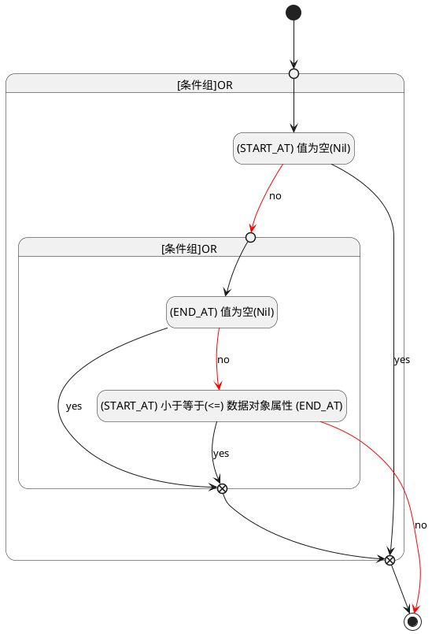

## 计划开始(START_AT) <!-- {docsify-ignore-all} -->

   

### 开始时间 :id=START_AT

#### 条件说明

##### (START_AT) 值为空(Nil) :id=ad8786be7558368821eeab492aa630f77

`START_AT(计划开始)` ISNULL 

##### (END_AT) 值为空(Nil) :id=aae4bd6c6d5505bd0626172f51e15a47a

`END_AT(计划结束)` ISNULL 

##### (START_AT) 小于等于(<=) 数据对象属性 (END_AT) :id=af03fc11233a5f454912f9d93b198dff0

`START_AT(计划开始)` LTANDEQ  `END_AT`

> [!ATTENTION|label:规则信息|icon:fa fa-warning]
> 开始时间必须小于等于发布时间

