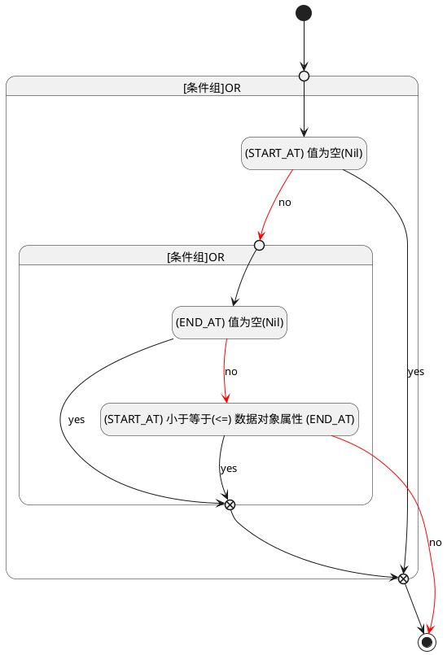

## 计划开始(START_AT) <!-- {docsify-ignore-all} -->

   

### 开始时间 :id=START_AT

#### 条件说明

##### (END_AT) 值为空(Nil) :id=ab691c2ef85a530320e7a43cd0f981826

`END_AT(计划结束)` ISNULL 

##### (START_AT) 值为空(Nil) :id=a70a9800723712d378f5de17e841168fc

`START_AT(计划开始)` ISNULL 

##### (START_AT) 小于等于(<=) 数据对象属性 (END_AT) :id=adf7b141d77f911250e7147132a8c6152

`START_AT(计划开始)` LTANDEQ  `END_AT`

> [!ATTENTION|label:规则信息|icon:fa fa-warning]
> 开始时间必须小于等于发布时间

