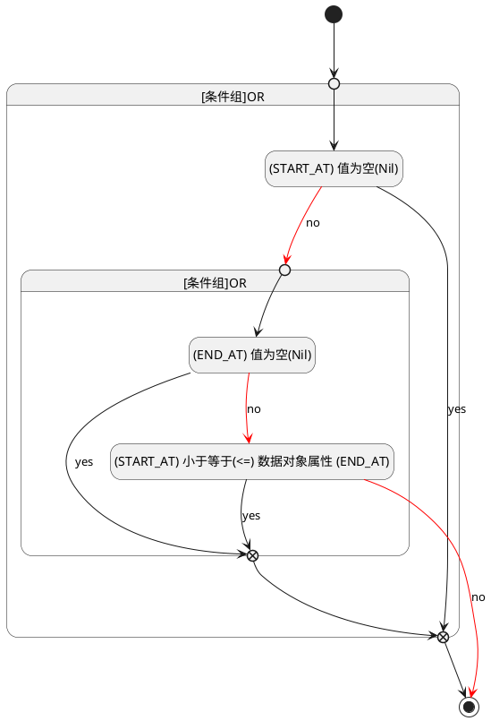

## 计划开始(START_AT) <!-- {docsify-ignore-all} -->

   

### 开始时间 :id=START_AT

```plantuml
@startuml
hide empty description
<style>
root {
  HyperlinkColor #42b983
}
</style>

state "start" as start  <<start>>
state "end" as end <<end>>
state "[条件组]OR" as 9d3799898b3fa100c0f0a954e42e232c [[$./start_at#a9d3799898b3fa100c0f0a954e42e232c {"[条件组]OR"}]] {
state " " as 9d3799898b3fa100c0f0a954e42e232c_entry  <<entryPoint>>
state "(START_AT) 值为空(Nil)" as ef1d0bf67e76e4c599bcf41daa4774e6 [[$./start_at#aef1d0bf67e76e4c599bcf41daa4774e6 {"[常规条件] 值为空(Nil)"}]]
state "[条件组]OR" as df41aaede7f78e6d23ebfa1341743bf2 [[$./start_at#adf41aaede7f78e6d23ebfa1341743bf2 {"[条件组]OR"}]] {
state " " as df41aaede7f78e6d23ebfa1341743bf2_entry  <<entryPoint>>
state "(END_AT) 值为空(Nil)" as 733546002954fe06fa7c37fa4e3e5c8f [[$./start_at#a733546002954fe06fa7c37fa4e3e5c8f {"[常规条件] 值为空(Nil)"}]]
state "(START_AT) 小于等于(<=) 数据对象属性 (END_AT)" as a1566f4c2ab5ddc7dde712585f4b607c [[$./start_at#aa1566f4c2ab5ddc7dde712585f4b607c {"[常规条件] 小于等于(<=) 数据对象属性 (END_AT)"}]]
state " " as df41aaede7f78e6d23ebfa1341743bf2_exit  <<exitPoint>>
}
state " " as 9d3799898b3fa100c0f0a954e42e232c_exit  <<exitPoint>>
}


start --> 9d3799898b3fa100c0f0a954e42e232c_entry 
9d3799898b3fa100c0f0a954e42e232c_entry --> ef1d0bf67e76e4c599bcf41daa4774e6 
ef1d0bf67e76e4c599bcf41daa4774e6 --> 9d3799898b3fa100c0f0a954e42e232c_exit  : yes
ef1d0bf67e76e4c599bcf41daa4774e6 -[#red]-> df41aaede7f78e6d23ebfa1341743bf2_entry  : no

df41aaede7f78e6d23ebfa1341743bf2_entry --> 733546002954fe06fa7c37fa4e3e5c8f 
733546002954fe06fa7c37fa4e3e5c8f --> df41aaede7f78e6d23ebfa1341743bf2_exit  : yes
733546002954fe06fa7c37fa4e3e5c8f -[#red]-> a1566f4c2ab5ddc7dde712585f4b607c  : no

a1566f4c2ab5ddc7dde712585f4b607c --> df41aaede7f78e6d23ebfa1341743bf2_exit  : yes
a1566f4c2ab5ddc7dde712585f4b607c -[#red]-> end  : no
df41aaede7f78e6d23ebfa1341743bf2_exit --> 9d3799898b3fa100c0f0a954e42e232c_exit 
9d3799898b3fa100c0f0a954e42e232c_exit --> end 


@enduml
```

#### 条件说明

##### (END_AT) 值为空(Nil) :id=a733546002954fe06fa7c37fa4e3e5c8f

`END_AT(计划结束)` ISNULL 

##### (START_AT) 小于等于(<=) 数据对象属性 (END_AT) :id=aa1566f4c2ab5ddc7dde712585f4b607c

`START_AT(计划开始)` LTANDEQ  `END_AT`

> [!ATTENTION|label:规则信息|icon:fa fa-warning]
> 开始时间必须小于等于发布时间

##### (START_AT) 值为空(Nil) :id=aef1d0bf67e76e4c599bcf41daa4774e6

`START_AT(计划开始)` ISNULL 

