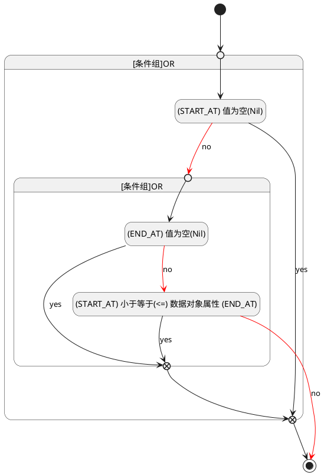

## 计划开始(START_AT) <!-- {docsify-ignore-all} -->

   

### 开始时间 :id=START_AT

```plantuml
@startuml
hide empty description
<style>
root {
  HyperlinkColor #42b983
}
</style>

state "start" as start  <<start>>
state "end" as end <<end>>
state "[条件组]OR" as 77beb16fc2ff8160d0869e7a6ab6deb9 [[$./start_at#a77beb16fc2ff8160d0869e7a6ab6deb9 {"[条件组]OR"}]] {
state " " as 77beb16fc2ff8160d0869e7a6ab6deb9_entry  <<entryPoint>>
state "(START_AT) 值为空(Nil)" as cef92c1ca6765c1a85ee1285c86ff837 [[$./start_at#acef92c1ca6765c1a85ee1285c86ff837 {"[常规条件] 值为空(Nil)"}]]
state "[条件组]OR" as c72e9385e56167a8f56c2c7fa92ac191 [[$./start_at#ac72e9385e56167a8f56c2c7fa92ac191 {"[条件组]OR"}]] {
state " " as c72e9385e56167a8f56c2c7fa92ac191_entry  <<entryPoint>>
state "(END_AT) 值为空(Nil)" as d3889f50d964b666947bb25a21e2c332 [[$./start_at#ad3889f50d964b666947bb25a21e2c332 {"[常规条件] 值为空(Nil)"}]]
state "(START_AT) 小于等于(<=) 数据对象属性 (END_AT)" as c40e886c0ace250b458513b74dc737b3 [[$./start_at#ac40e886c0ace250b458513b74dc737b3 {"[常规条件] 小于等于(<=) 数据对象属性 (END_AT)"}]]
state " " as c72e9385e56167a8f56c2c7fa92ac191_exit  <<exitPoint>>
}
state " " as 77beb16fc2ff8160d0869e7a6ab6deb9_exit  <<exitPoint>>
}


start --> 77beb16fc2ff8160d0869e7a6ab6deb9_entry 
77beb16fc2ff8160d0869e7a6ab6deb9_entry --> cef92c1ca6765c1a85ee1285c86ff837 
cef92c1ca6765c1a85ee1285c86ff837 --> 77beb16fc2ff8160d0869e7a6ab6deb9_exit  : yes
cef92c1ca6765c1a85ee1285c86ff837 -[#red]-> c72e9385e56167a8f56c2c7fa92ac191_entry  : no

c72e9385e56167a8f56c2c7fa92ac191_entry --> d3889f50d964b666947bb25a21e2c332 
d3889f50d964b666947bb25a21e2c332 --> c72e9385e56167a8f56c2c7fa92ac191_exit  : yes
d3889f50d964b666947bb25a21e2c332 -[#red]-> c40e886c0ace250b458513b74dc737b3  : no

c40e886c0ace250b458513b74dc737b3 --> c72e9385e56167a8f56c2c7fa92ac191_exit  : yes
c40e886c0ace250b458513b74dc737b3 -[#red]-> end  : no
c72e9385e56167a8f56c2c7fa92ac191_exit --> 77beb16fc2ff8160d0869e7a6ab6deb9_exit 
77beb16fc2ff8160d0869e7a6ab6deb9_exit --> end 


@enduml
```

#### 条件说明

##### (END_AT) 值为空(Nil) :id=ad3889f50d964b666947bb25a21e2c332

`END_AT(计划结束)` ISNULL 

##### (START_AT) 小于等于(<=) 数据对象属性 (END_AT) :id=ac40e886c0ace250b458513b74dc737b3

`START_AT(计划开始)` LTANDEQ  `END_AT`

> [!ATTENTION|label:规则信息|icon:fa fa-warning]
> 开始时间必须小于等于发布时间

##### (START_AT) 值为空(Nil) :id=acef92c1ca6765c1a85ee1285c86ff837

`START_AT(计划开始)` ISNULL 

