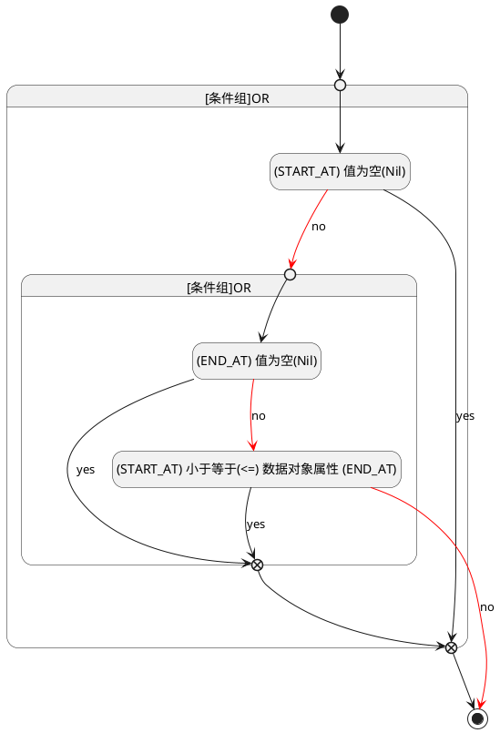

## 计划开始(START_AT) <!-- {docsify-ignore-all} -->

   

### 开始时间 :id=START_AT

```plantuml
@startuml
hide empty description
<style>
root {
  HyperlinkColor #42b983
}
</style>

state "start" as start  <<start>>
state "end" as end <<end>>
state "[条件组]OR" as 6455296f90a294ee8cbac2983c66438d [[$./start_at#a6455296f90a294ee8cbac2983c66438d {"[条件组]OR"}]] {
state " " as 6455296f90a294ee8cbac2983c66438d_entry  <<entryPoint>>
state "(START_AT) 值为空(Nil)" as 9c644eb8b55ec1fb7da4d067151f0feb [[$./start_at#a9c644eb8b55ec1fb7da4d067151f0feb {"[常规条件] 值为空(Nil)"}]]
state "[条件组]OR" as 66ae8537ecfae346bec1d7abedf01403 [[$./start_at#a66ae8537ecfae346bec1d7abedf01403 {"[条件组]OR"}]] {
state " " as 66ae8537ecfae346bec1d7abedf01403_entry  <<entryPoint>>
state "(END_AT) 值为空(Nil)" as 86060104057086bfb19dc2a29d14e92d [[$./start_at#a86060104057086bfb19dc2a29d14e92d {"[常规条件] 值为空(Nil)"}]]
state "(START_AT) 小于等于(<=) 数据对象属性 (END_AT)" as 70a9800723712d378f5de17e841168fc [[$./start_at#a70a9800723712d378f5de17e841168fc {"[常规条件] 小于等于(<=) 数据对象属性 (END_AT)"}]]
state " " as 66ae8537ecfae346bec1d7abedf01403_exit  <<exitPoint>>
}
state " " as 6455296f90a294ee8cbac2983c66438d_exit  <<exitPoint>>
}


start --> 6455296f90a294ee8cbac2983c66438d_entry 
6455296f90a294ee8cbac2983c66438d_entry --> 9c644eb8b55ec1fb7da4d067151f0feb 
9c644eb8b55ec1fb7da4d067151f0feb --> 6455296f90a294ee8cbac2983c66438d_exit  : yes
9c644eb8b55ec1fb7da4d067151f0feb -[#red]-> 66ae8537ecfae346bec1d7abedf01403_entry  : no

66ae8537ecfae346bec1d7abedf01403_entry --> 86060104057086bfb19dc2a29d14e92d 
86060104057086bfb19dc2a29d14e92d --> 66ae8537ecfae346bec1d7abedf01403_exit  : yes
86060104057086bfb19dc2a29d14e92d -[#red]-> 70a9800723712d378f5de17e841168fc  : no

70a9800723712d378f5de17e841168fc --> 66ae8537ecfae346bec1d7abedf01403_exit  : yes
70a9800723712d378f5de17e841168fc -[#red]-> end  : no
66ae8537ecfae346bec1d7abedf01403_exit --> 6455296f90a294ee8cbac2983c66438d_exit 
6455296f90a294ee8cbac2983c66438d_exit --> end 


@enduml
```

#### 条件说明

##### (START_AT) 值为空(Nil) :id=a9c644eb8b55ec1fb7da4d067151f0feb

`START_AT(计划开始)` ISNULL 

##### (START_AT) 小于等于(<=) 数据对象属性 (END_AT) :id=a70a9800723712d378f5de17e841168fc

`START_AT(计划开始)` LTANDEQ  `END_AT`

> [!ATTENTION|label:规则信息|icon:fa fa-warning]
> 开始时间必须小于等于发布时间

##### (END_AT) 值为空(Nil) :id=a86060104057086bfb19dc2a29d14e92d

`END_AT(计划结束)` ISNULL 

