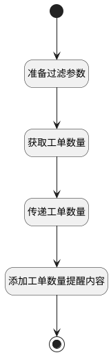

## 获取关联的工单数量 <!-- {docsify-ignore-all} -->

   在删除产品标签时，获取与之关联的工单数量。

### 处理过程




### 处理步骤说明

#### 开始 :id=Begin<sup class="footnote-symbol"> <font color=gray size=1>[开始]</font></sup>


*- N/A*
#### 准备过滤参数 :id=PREPAREPARAM2<sup class="footnote-symbol"> <font color=gray size=1>[准备参数]</font></sup>


1. 将`Default(传入变量).ID(标识)` 设置给  `filter(过滤器).n_tags_like`
2. 将`1` 设置给  `filter(过滤器).size`

#### 获取工单数量 :id=DEDATASET1<sup class="footnote-symbol"> <font color=gray size=1>[实体数据集]</font></sup>


调用实体 [工单(TICKET)](module/ProdMgmt/ticket.md) 数据集合 [数据集(DEFAULT)](module/ProdMgmt/ticket#数据集合) ，查询参数为`filter(过滤器)`

将执行结果返回给参数`ticket_page(工单分页结果变量)`

#### 传递工单数量 :id=PREPAREPARAM1<sup class="footnote-symbol"> <font color=gray size=1>[准备参数]</font></sup>


1. 将`ticket_page(工单分页结果变量).total` 设置给  `Default(传入变量).num`

#### 添加工单数量提醒内容 :id=RAWSFCODE1<sup class="footnote-symbol"> <font color=gray size=1>[直接后台代码]</font></sup>


<p class="panel-title"><b>执行代码[JavaScript]</b></p>

```javascript
var tag = logic.getParam("Default");
var num = tag.get("num");
tag.set("remind", "标签删除后不可恢复。共 " + num + " 个工单正在使用此标签，删除后会从对应事项中移除。");

```

#### 结束 :id=END1<sup class="footnote-symbol"> <font color=gray size=1>[结束]</font></sup>


返回 `Default(传入变量)`


### 实体逻辑参数

|    中文名   |    代码名    |  数据类型    |  实体   |备注 |
| --------| --------| -------- | -------- | --------   |
|传入变量(<i class="fa fa-check"/></i>)|Default|数据对象|[产品标签(PRODUCT_TAG)](module/ProdMgmt/product_tag.md)||
|过滤器|filter|过滤器|||
|工单分页结果变量|ticket_page|分页查询|||
