## 归档 <!-- {docsify-ignore-all} -->

   未归档工单数据的归档处理，修改工单的归档状态为归档

### 处理过程

```plantuml
@startuml
hide empty description
<style>
root {
  HyperlinkColor #42b983
}
</style>

hide empty description
state "开始" as Begin <<start>> [[$./archive#begin {"开始"}]]
state "修改是否归档标识" as PREPAREPARAM1  [[$./archive#prepareparam1 {"修改是否归档标识"}]]
state "执行更新操作" as DEACTION1  [[$./archive#deaction1 {"执行更新操作"}]]
state "结束" as END1 <<end>> [[$./archive#end1 {"结束"}]]


Begin --> PREPAREPARAM1
PREPAREPARAM1 --> DEACTION1
DEACTION1 --> END1


@enduml
```

### 处理步骤说明

#### 开始 :id=Begin [开始]

*- N/A*
#### 修改是否归档标识 :id=PREPAREPARAM1 [准备参数]

1. 将`1` 设置给  `temp_obj(临时变量).IS_ARCHIVED(是否已归档)`
2. 将`Default(传入变量).id(标识)` 设置给  `temp_obj(临时变量).ID(标识)`

#### 执行更新操作 :id=DEACTION1 [实体行为]

调用实体 [工单(TICKET)](module/ProdMgmt/ticket.md) 行为 [Update](module/ProdMgmt/ticket#行为) ，行为参数为`temp_obj(临时变量)`

#### 结束 :id=END1 [结束]

*- N/A*

### 实体逻辑参数

|    中文名   |    代码名    |  数据类型    |  实体   |备注 |
| --------| --------| -------- | -------- | --------   |
|传入变量(<i class="fa fa-check"/></i>)|Default|数据对象|[工单(TICKET)](module/ProdMgmt/ticket.md)||
|要更改状态的主键|id|简单数据|||
|选中的主键|ids|简单数据列表|||
|临时变量|temp_obj|数据对象|[工单(TICKET)](module/ProdMgmt/ticket.md)||
