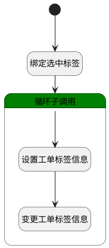

## 设置标签 <!-- {docsify-ignore-all} -->

   设置工单标签，修改工单标签信息

### 处理过程

### 处理步骤说明

#### 开始 :id=Begin [开始]

*- N/A*
#### 绑定选中标签 :id=BINDPARAM1 [绑定参数]

绑定参数`Default(传入变量)` 到 `srfactionparam(选择数据对象)`
#### 循环子调用 :id=LOOPSUBCALL1 [循环子调用]

循环参数`srfactionparam(选择数据对象)`，子循环参数使用`for_temp_obj(循环临时变量)`
#### 设置工单标签信息 :id=PREPAREPARAM2 [准备参数]

1. 将`for_temp_obj(循环临时变量).tags(标签)` 设置给  `Default(传入变量).TAGS(标签)`

#### 变更工单标签信息 :id=DEACTION1 [实体行为]

调用实体 [工单(TICKET)](module/ProdMgmt/ticket.md) 行为 [Update](module/ProdMgmt/ticket#行为) ，行为参数为`Default(传入变量)`

### 实体逻辑参数

|    中文名   |    代码名    |  数据类型    |  实体   |备注 |
| --------| --------| -------- | -------- | --------   |
|传入变量(<i class="fa fa-check"/></i>)|Default|数据对象|[工单(TICKET)](module/ProdMgmt/ticket.md)||
|循环临时变量|for_temp_obj|数据对象|[工单(TICKET)](module/ProdMgmt/ticket.md)||
|选择数据对象|srfactionparam|数据对象列表|[工单(TICKET)](module/ProdMgmt/ticket.md)||
