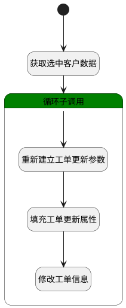

## 客户选择工单 <!-- {docsify-ignore-all} -->

   客户选择工单操作

### 处理过程




### 处理步骤说明

#### 开始 :id=Begin<sup class="footnote-symbol"> <font color=gray size=1>[开始]</font></sup>


*- N/A*
#### 获取选中客户数据 :id=PREPAREPARAM1<sup class="footnote-symbol"> <font color=gray size=1>[准备参数]</font></sup>


1. 将`Default(传入变量).srfactionparam` 绑定给  `srfactionparam(选中的客户列表)`

#### 循环子调用 :id=LOOPSUBCALL1<sup class="footnote-symbol"> <font color=gray size=1>[循环子调用]</font></sup>


循环参数`srfactionparam(选中的客户列表)`，子循环参数使用`for_temp_obj(循环临时变量)`
#### 重新建立工单更新参数 :id=RENEWPARAM1<sup class="footnote-symbol"> <font color=gray size=1>[重新建立参数]</font></sup>


重建参数```update_obj(更新对象)```
#### 填充工单更新属性 :id=PREPAREPARAM2<sup class="footnote-symbol"> <font color=gray size=1>[准备参数]</font></sup>


1. 将`for_temp_obj(循环临时变量).owner_id` 设置给  `update_obj(更新对象).ID(标识)`
2. 将`Default(传入变量).customer_id(客户标识)` 设置给  `update_obj(更新对象).CUSTOMER_ID(客户标识)`

#### 修改工单信息 :id=DEACTION1<sup class="footnote-symbol"> <font color=gray size=1>[实体行为]</font></sup>


调用实体 [工单(TICKET)](module/ProdMgmt/ticket.md) 行为 [Update](module/ProdMgmt/ticket#行为) ，行为参数为`update_obj(更新对象)`


### 实体逻辑参数

|    中文名   |    代码名    |  数据类型    |  实体   |备注 |
| --------| --------| -------- | -------- | --------   |
|传入变量(<i class="fa fa-check"/></i>)|Default|数据对象|[工单(TICKET)](module/ProdMgmt/ticket.md)||
|循环临时变量|for_temp_obj|数据对象|[工单(TICKET)](module/ProdMgmt/ticket.md)||
|选中的客户列表|srfactionparam|数据对象列表|[工单(TICKET)](module/ProdMgmt/ticket.md)||
|当前工单|this_ticket|数据对象|[工单(TICKET)](module/ProdMgmt/ticket.md)||
|更新对象|update_obj|数据对象|[工单(TICKET)](module/ProdMgmt/ticket.md)||
