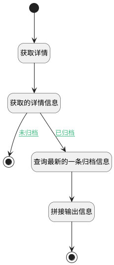

## 查询归档数据 <!-- {docsify-ignore-all} -->

   查询数据是否归档，归档则返回归档信息

### 处理过程




### 处理步骤说明

#### 开始 :id=Begin<sup class="footnote-symbol"> <font color=gray size=1>[开始]</font></sup>


*- N/A*
#### 结束 :id=END1<sup class="footnote-symbol"> <font color=gray size=1>[结束]</font></sup>


返回 `get_infos(获取的信息)`

#### 获取详情 :id=DEACTION1<sup class="footnote-symbol"> <font color=gray size=1>[实体行为]</font></sup>


调用实体 [工单(TICKET)](module/ProdMgmt/ticket.md) 行为 [Get](module/ProdMgmt/ticket#行为) ，行为参数为`Default(传入变量)`

将执行结果返回给参数`get_infos(获取的信息)`

#### 获取的详情信息 :id=DEBUGPARAM2<sup class="footnote-symbol"> <font color=gray size=1>[调试逻辑参数]</font></sup>


> [!NOTE|label:调试信息|icon:fa fa-bug]
> 调试输出参数`get_infos(获取的信息)`的详细信息


#### 查询最新的一条归档信息 :id=RAWSQLCALL1<sup class="footnote-symbol"> <font color=gray size=1>[直接SQL调用]</font></sup>


<p class="panel-title"><b>执行sql语句</b></p>

```sql
SELECT *
FROM activitiy
WHERE OBJECTID = ? AND AUDITTYPE = 'archive'
ORDER BY CREATE_TIME DESC
LIMIT 1;
```

<p class="panel-title"><b>执行sql参数</b></p>

1. `Default(传入变量).ID(标识)`

重置参数`activity_info(活动信息)`，并将执行sql结果赋值给参数`activity_info(活动信息)`

#### 拼接输出信息 :id=RAWSFCODE1<sup class="footnote-symbol"> <font color=gray size=1>[直接后台代码]</font></sup>


<p class="panel-title"><b>执行代码[JavaScript]</b></p>

```javascript
var activity_infos = logic.getParam("activity_info");
var get_infos = logic.getParam("get_infos") || {}; 

var create_time = activity_infos.get("create_time");
var create_man = activity_infos.get("oppersonname");

var print_info = create_man + '于' + create_time + '归档了工作项';

get_infos.set("archived_info",print_info);


```

#### 结束 :id=END2<sup class="footnote-symbol"> <font color=gray size=1>[结束]</font></sup>


返回 `get_infos(获取的信息)`


### 连接条件说明
#### 未归档 :id=DEBUGPARAM2-END1

`get_infos(获取的信息).is_archived(是否已归档)` EQ `0`
#### 已归档 :id=DEBUGPARAM2-RAWSQLCALL1

`get_infos(获取的信息).is_archived(是否已归档)` EQ `1`


### 实体逻辑参数

|    中文名   |    代码名    |  数据类型    |  实体   |备注 |
| --------| --------| -------- | -------- | --------   |
|传入变量(<i class="fa fa-check"/></i>)|Default|数据对象|[工单(TICKET)](module/ProdMgmt/ticket.md)||
|活动信息|activity_info|数据对象|[活动(ACTIVITY)](module/Base/activity.md)||
|获取的信息|get_infos|数据对象|[工单(TICKET)](module/ProdMgmt/ticket.md)||
