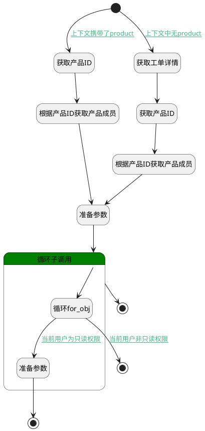

## 获取产品成员 <!-- {docsify-ignore-all} -->

   获取产品成员信息，用于判断当前登陆者权限

### 处理过程

### 处理步骤说明

#### 开始 :id=Begin [开始]

*- N/A*
#### 获取产品ID :id=PREPAREPARAM2 [准备参数]

1. 将`Default(传入变量).PRODUCT` 设置给  `filter(过滤器).N_PRODUCT_ID_EQ`

#### 根据产品ID获取产品成员 :id=DEDATASET2 [实体数据集]

调用实体 [产品成员(PRODUCT_MEMBER)](module/ProdMgmt/product_member.md) 数据集合 [数据集(DEFAULT)](module/ProdMgmt/product_member#数据集合) ，查询参数为`filter(过滤器)`

将执行结果返回给参数`members(成员)`

#### 获取工单详情 :id=DEACTION1 [实体行为]

调用实体 [工单(TICKET)](module/ProdMgmt/ticket.md) 行为 [Get](module/ProdMgmt/ticket#行为) ，行为参数为`Default(传入变量)`

将执行结果返回给参数`ticket(工单)`

#### 获取产品ID :id=PREPAREPARAM1 [准备参数]

1. 将`ticket(工单).PRODUCT_ID(产品标识)` 设置给  `filter(过滤器).N_PRODUCT_ID_EQ`

#### 根据产品ID获取产品成员 :id=DEDATASET1 [实体数据集]

调用实体 [产品成员(PRODUCT_MEMBER)](module/ProdMgmt/product_member.md) 数据集合 [数据集(DEFAULT)](module/ProdMgmt/product_member#数据集合) ，查询参数为`filter(过滤器)`

将执行结果返回给参数`members(成员)`

#### 准备参数 :id=PREPAREPARAM3 [准备参数]

1. 将`用户全局对象.srfpersonid` 设置给  `user(当前登录人).ID`

#### 结束 :id=END3 [结束]

返回 `跳出循环（BREAK）`

#### 循环子调用 :id=LOOPSUBCALL1 [循环子调用]

循环参数`members(成员)`，子循环参数使用`for_obj(循环临时变量)`
#### 循环for_obj :id=DEBUGPARAM5 [调试逻辑参数]

> [!NOTE|label:调试信息|icon:fa fa-bug]
> 调试输出参数`for_obj(循环临时变量)`的详细信息

#### 准备参数 :id=PREPAREPARAM4 [准备参数]

1. 将`true` 设置给  `user(当前登录人).readonly`

#### 结束 :id=END2 [结束]

返回 `user(当前登录人)`

#### 跳出循环 :id=END1 [结束]

返回 `跳出循环（BREAK）`

### 连接条件说明
#### 上下文中无product :id=Begin-DEACTION1

`Default(传入变量).product` ISNULL
#### 当前用户为只读权限 :id=DEBUGPARAM5-PREPAREPARAM4

`for_obj(循环临时变量).ROLE_ID` EQ `reader` AND 
#### 当前用户非只读权限 :id=DEBUGPARAM5-END3

 AND `for_obj(循环临时变量).role_id` NOTEQ `reader`
#### 上下文携带了product :id=Begin-PREPAREPARAM2

`Default(传入变量).product` ISNOTNULL

### 实体逻辑参数

|    中文名   |    代码名    |  数据类型    |  实体   |备注 |
| --------| --------| -------- | -------- | --------   |
|传入变量(<i class="fa fa-check"/></i>)|Default|数据对象|[工单(TICKET)](module/ProdMgmt/ticket.md)||
|过滤器|filter|过滤器|||
|循环临时变量|for_obj|数据对象|||
|成员|members|分页查询|||
|工单|ticket|数据对象|[工单(TICKET)](module/ProdMgmt/ticket.md)||
|当前登录人|user|数据对象|||
|viewctx|viewctx||||
