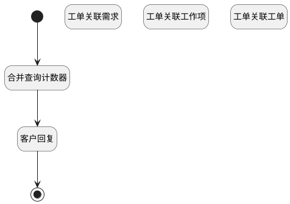

## 产品工单关联分页计数器 <!-- {docsify-ignore-all} -->

   计算分页下关联事项的条数

### 处理过程




### 处理步骤说明

#### 工单关联需求 :id=RAWSQLCALL1<sup class="footnote-symbol"> <font color=gray size=1>[直接SQL调用]</font></sup>


<p class="panel-title"><b>执行sql语句</b></p>

```sql
-- 工单关联需求
SELECT
	count( t.id ) AS ticket_re_idea
FROM
	idea t 
WHERE
	EXISTS (
	SELECT
		* 
	FROM
		`RELATION` t11 
	WHERE
		t.`ID` = t11.`TARGET_ID` 
		AND (
			t11.`TARGET_TYPE` = 'idea' 
			AND t11.`PRINCIPAL_TYPE` = 'ticket' 
			AND t11.`PRINCIPAL_ID` = ? ) )
			AND t.`IS_DELETED` = 0 

```

<p class="panel-title"><b>执行sql参数</b></p>

1. `Default(传入变量).ID(标识)`

重置参数`Default(传入变量)`，并将执行sql结果赋值给参数`Default(传入变量)`

#### 工单关联工作项 :id=RAWSQLCALL2<sup class="footnote-symbol"> <font color=gray size=1>[直接SQL调用]</font></sup>


<p class="panel-title"><b>执行sql语句</b></p>

```sql
-- 工单关联工作项
SELECT
	count( t.id ) AS ticket_re_work_item
FROM
	work_item t 
WHERE
	EXISTS (
	SELECT
		* 
	FROM
		`RELATION` t11 
	WHERE
		t.`ID` = t11.`TARGET_ID` 
		AND ( t11.`PRINCIPAL_ID` = ? 
        AND t11.`TARGET_TYPE` = 'work_item' 
        AND t11.`PRINCIPAL_TYPE` = 'ticket' ) 
	) 
	AND  t.`IS_DELETED` = 0
```

<p class="panel-title"><b>执行sql参数</b></p>

1. `Default(传入变量).ID(标识)`

重置参数`Default(传入变量)`，并将执行sql结果赋值给参数`Default(传入变量)`

#### 工单关联工单 :id=RAWSQLCALL3<sup class="footnote-symbol"> <font color=gray size=1>[直接SQL调用]</font></sup>


<p class="panel-title"><b>执行sql语句</b></p>

```sql
-- 工单关联工单
SELECT
	count( t.id ) AS ticket_re_ticket 
FROM
	ticket t 
WHERE
	EXISTS (
	SELECT
		* 
	FROM
		`RELATION` t11 
	WHERE
		t.`ID` = t11.`TARGET_ID` 
		AND ( t11.`PRINCIPAL_ID` = ? 
        AND t11.`TARGET_TYPE` = 'ticket'
        AND t11.`PRINCIPAL_TYPE` = 'ticket' ) 
	) 
    AND t.`IS_DELETED` = 0
```

<p class="panel-title"><b>执行sql参数</b></p>

1. `Default(传入变量).ID(标识)`

重置参数`Default(传入变量)`，并将执行sql结果赋值给参数`Default(传入变量)`

#### 开始 :id=Begin<sup class="footnote-symbol"> <font color=gray size=1>[开始]</font></sup>


*- N/A*
#### 结束 :id=END1<sup class="footnote-symbol"> <font color=gray size=1>[结束]</font></sup>


返回 `Default(传入变量)`

#### 合并查询计数器 :id=RAWSQLCALL5<sup class="footnote-symbol"> <font color=gray size=1>[直接SQL调用]</font></sup>


<p class="panel-title"><b>执行sql语句</b></p>

```sql
SELECT
    COALESCE(SUM(CASE WHEN t11.`TARGET_TYPE` = 'idea' AND t11.`PRINCIPAL_TYPE` = 'ticket' AND t1.IS_DELETED=0 THEN 1 ELSE 0 END),0) AS ticket_re_idea,
    COALESCE(SUM(CASE WHEN t11.`TARGET_TYPE` = 'ticket' AND t11.`PRINCIPAL_TYPE` = 'ticket' AND t3.IS_DELETED=0 THEN 1 ELSE 0 END),0) AS ticket_re_ticket,
    COALESCE(SUM(CASE WHEN t11.`TARGET_TYPE` = 'work_item' AND t11.`PRINCIPAL_TYPE` = 'ticket' AND t4.IS_DELETED=0 THEN 1 ELSE 0 END),0) AS ticket_re_work_item
FROM
    `RELATION` t11
JOIN
    `ticket` t ON t.`ID` = t11.`PRINCIPAL_ID`
LEFT JOIN
    `idea` t1 ON t1.ID = t11.TARGET_ID 
LEFT JOIN
    `ticket` t3 ON t3.ID = t11.TARGET_ID 
LEFT JOIN
    `work_item` t4 ON t4.ID = t11.TARGET_ID
WHERE
    (t11.`PRINCIPAL_ID` = ?);
```

<p class="panel-title"><b>执行sql参数</b></p>

1. `Default(传入变量).ID(标识)`

重置参数`Default(传入变量)`，并将执行sql结果赋值给参数`Default(传入变量)`

#### 客户回复 :id=RAWSQLCALL4<sup class="footnote-symbol"> <font color=gray size=1>[直接SQL调用]</font></sup>


<p class="panel-title"><b>执行sql语句</b></p>

```sql
SELECT
    count( t.id ) AS customer_comment
FROM
    comment t
WHERE t.`OWNER_TYPE` = 'CUSTOMER_CONNECT'
     AND t.`PRINCIPAL_TYPE` = 'CUSTOMER_CONNECT'
     AND t.`PRINCIPAL_ID` = ?
```

<p class="panel-title"><b>执行sql参数</b></p>

1. `Default(传入变量).ID(标识)`

重置参数`Default(传入变量)`，并将执行sql结果赋值给参数`Default(传入变量)`


### 实体逻辑参数

|    中文名   |    代码名    |  数据类型    |  实体   |备注 |
| --------| --------| -------- | -------- | --------   |
|传入变量(<i class="fa fa-check"/></i>)|Default|数据对象|[工单(TICKET)](module/ProdMgmt/ticket.md)||
