## 工单只读用户判断 <!-- {docsify-ignore-all} -->

   判断当前用户是否为只读用户，调用后台处理逻辑获取当前产品成员并判断返回

### 处理过程

```plantuml
@startuml
hide footbox
<style>
root {
  HyperlinkColor #42b983
}
</style>

hide empty description
state "开始" as Begin <<start>> [[$./ticket_readonly_recognize#begin {开始}]]
state "传递是否只读给页面" as PREPAREJSPARAM2  [[$./ticket_readonly_recognize#preparejsparam2 {传递是否只读给页面}]]
state "结束" as END1 <<end>> [[$./ticket_readonly_recognize#end1 {结束}]]
state "实体行为" as DEACTION1  [[$./ticket_readonly_recognize#deaction1 {实体行为}]]


Begin --> DEACTION1
DEACTION1 --> PREPAREJSPARAM2 : [[$./ticket_readonly_recognize#deaction1-preparejsparam2{连接名称} 连接名称]]
PREPAREJSPARAM2 --> END1


@enduml
```




### 处理步骤说明

#### 开始 :id=Begin<sup class="footnote-symbol"> <font color=gray size=1>[开始]</font></sup>


#### 结束 :id=END1<sup class="footnote-symbol"> <font color=gray size=1>[结束]</font></sup>


#### 实体行为 :id=DEACTION1<sup class="footnote-symbol"> <font color=gray size=1>[实体行为]</font></sup>


调用实体 [工单(TICKET)](module/ProdMgmt/ticket.md) 行为 [工单只读用户判断(ticket_readonly_recognize)](module/ProdMgmt/ticket#行为) ，行为参数为`Default(传入变量)`

将执行结果返回给参数`Default(传入变量)`

#### 传递是否只读给页面 :id=PREPAREJSPARAM2<sup class="footnote-symbol"> <font color=gray size=1>[准备参数]</font></sup>


1. 将`true` 设置给  `viewctx(上下文).srfreadonly`

### 连接条件说明
#### 连接名称 :id=DEACTION1-PREPAREJSPARAM2

```Default(传入变量).readonly``` EQ ```true```


### 实体逻辑参数

|    中文名   |    代码名    |  数据类型      |备注 |
| --------| --------| --------  | --------   |
|工单信息|ticket_info|数据对象||
|过滤器|filter|过滤器||
|应用对象|app_obj|应用程序变量||
|产品信息|product|数据对象||
|传入变量(<i class="fa fa-check"/></i>)|Default|数据对象||
|成员信息|members|分页查询||
|上下文|viewctx|导航视图参数绑定参数||
