## 显示下拉并展开选项（嵌入视图） <!-- {docsify-ignore-all} -->

   显示下拉区域并展开选项（工具栏）

### 处理过程

```plantuml
@startuml
hide footbox
<style>
root {
  HyperlinkColor #42b983
}
</style>

hide empty description
state "开始" as Begin <<start>> [[$./toolbar_show_dorpdown_data#begin {开始}]]
state "设置选择区域显示" as PREPAREJSPARAM2  [[$./toolbar_show_dorpdown_data#preparejsparam2 {设置选择区域显示}]]
state "展开下拉" as RAWJSCODE1  [[$./toolbar_show_dorpdown_data#rawjscode1 {展开下拉}]]
state "绑定部件对象" as PREPAREJSPARAM1  [[$./toolbar_show_dorpdown_data#preparejsparam1 {绑定部件对象}]]


Begin --> PREPAREJSPARAM1
PREPAREJSPARAM1 --> PREPAREJSPARAM2
PREPAREJSPARAM2 --> RAWJSCODE1


@enduml
```




### 处理步骤说明

#### 开始 :id=Begin<sup class="footnote-symbol"> <font color=gray size=1>[开始]</font></sup>


#### 绑定部件对象 :id=PREPAREJSPARAM1<sup class="footnote-symbol"> <font color=gray size=1>[准备参数]</font></sup>


1. 将`form(父视图表单).details.tabpanel1_ticket_druipart.embedView` 设置给  `curView(当前视图)`
2. 将`curView(当前视图).layoutPanel.panelItems.choose_data` 设置给  `choose_data_state_obj(选项框状态对象)`

#### 设置选择区域显示 :id=PREPAREJSPARAM2<sup class="footnote-symbol"> <font color=gray size=1>[准备参数]</font></sup>


1. 将`true` 设置给  `choose_data_state_obj(选项框状态对象).state.visible`

#### 展开下拉 :id=RAWJSCODE1<sup class="footnote-symbol"> <font color=gray size=1>[直接前台代码]</font></sup>


<p class="panel-title"><b>执行代码</b></p>

```javascript
if (uiLogic. choose_data_state_obj) {
    uiLogic.choose_data_state_obj.editor.toggleMenu(true);
}
```


### 实体逻辑参数

|    中文名   |    代码名    |  数据类型      |备注 |
| --------| --------| --------  | --------   |
|当前视图|curView|数据对象||
|选项框状态对象|choose_data_state_obj|数据对象||
|父视图表单|form|部件对象||
|父视图|parentView|当前视图对象||
|传入变量(<i class="fa fa-check"/></i>)|Default|数据对象||
