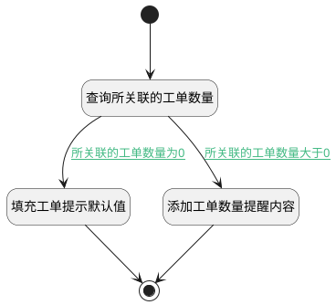

## 获取关联的工单 <!-- {docsify-ignore-all} -->

   在删除工单类型时，获取与之关联的工单数量以及提示信息。

### 处理过程




### 处理步骤说明

#### 开始 :id=Begin<sup class="footnote-symbol"> <font color=gray size=1>[开始]</font></sup>


*- N/A*
#### 查询所关联的工单数量 :id=RAWSQLCALL1<sup class="footnote-symbol"> <font color=gray size=1>[直接SQL调用]</font></sup>


<p class="panel-title"><b>执行sql语句</b></p>

```sql
select count(1) as ticket_num from ticket  where  type = ?
```

<p class="panel-title"><b>执行sql参数</b></p>

1. `Default(传入变量).ID(标识)`

重置参数`Default(传入变量)`，并将执行sql结果赋值给参数`Default(传入变量)`

#### 添加工单数量提醒内容 :id=RAWSFCODE1<sup class="footnote-symbol"> <font color=gray size=1>[直接后台代码]</font></sup>


<p class="panel-title"><b>执行代码[JavaScript]</b></p>

```javascript
var ticket = logic.getParam("Default");
var ticket_num = ticket.get("ticket_num");
ticket.set("remind", "该工单类型关联了" + ticket_num + "个工单，请先将对应的工单变更为其他工单类型再删除。");
ticket.set("disabled",1)
```

#### 填充工单提示默认值 :id=PREPAREPARAM1<sup class="footnote-symbol"> <font color=gray size=1>[准备参数]</font></sup>


1. 将`工单类型删除后不可恢复，后续不可再新建此类型的工单。` 设置给  `Default(传入变量).remind`
2. 将`0` 设置给  `Default(传入变量).disabled`

#### 结束 :id=END1<sup class="footnote-symbol"> <font color=gray size=1>[结束]</font></sup>


返回 `Default(传入变量)`


### 连接条件说明
#### 所关联的工单数量大于0 :id=RAWSQLCALL1-RAWSFCODE1

`Default(传入变量).ticket_num` GT `0`
#### 所关联的工单数量为0 :id=RAWSQLCALL1-PREPAREPARAM1

`Default(传入变量).ticket_num` EQ `0`


### 实体逻辑参数

|    中文名   |    代码名    |  数据类型    |  实体   |备注 |
| --------| --------| -------- | -------- | --------   |
|传入变量(<i class="fa fa-check"/></i>)|Default|数据对象|[工单类型(TICKET_TYPE)](module/ProdMgmt/ticket_type.md)||
