## 判断是否禁用 <!-- {docsify-ignore-all} -->

   确认删除视图判断是否禁用确定按钮

### 处理过程

```plantuml
@startuml
hide footbox
<style>
root {
  HyperlinkColor #42b983
}
</style>

hide empty description
state "开始" as Begin <<start>> [[$./is_disabled#begin {开始}]]
state "结束" as END1 <<end>> [[$./is_disabled#end1 {结束}]]
state "判断是否禁用" as RAWJSCODE1  [[$./is_disabled#rawjscode1 {判断是否禁用}]]


Begin --> RAWJSCODE1
RAWJSCODE1 --> END1


@enduml
```




### 处理步骤说明

#### 开始 :id=Begin<sup class="footnote-symbol"> <font color=gray size=1>[开始]</font></sup>


#### 判断是否禁用 :id=RAWJSCODE1<sup class="footnote-symbol"> <font color=gray size=1>[直接前台代码]</font></sup>


<p class="panel-title"><b>执行代码</b></p>

```javascript
var disabled = view.layoutPanel.panelItems.form.control.state.data.disabled;
if(disabled === 1){
    view.layoutPanel.panelItems.button_okaction.state.disabled = true;
}

```

#### 结束 :id=END1<sup class="footnote-symbol"> <font color=gray size=1>[结束]</font></sup>


### 实体逻辑参数

|    中文名   |    代码名    |  数据类型      |备注 |
| --------| --------| --------  | --------   |
|传入变量(<i class="fa fa-check"/></i>)|Default|数据对象||
|是否禁用|disabled|数据对象||
|表单|form|部件对象||
