## 从项目集中移除 <!-- {docsify-ignore-all} -->

   

### 处理过程

```plantuml
@startuml
hide empty description
<style>
root {
  HyperlinkColor #42b983
}
</style>

hide empty description
state "开始" as Begin <<start>> [[$./remove_from_project_set#begin {"开始"}]]
state "调试逻辑参数" as DEBUGPARAM1  [[$./remove_from_project_set#debugparam1 {"调试逻辑参数"}]]
state "从项目集中删除" as RAWSQLCALL1  [[$./remove_from_project_set#rawsqlcall1 {"从项目集中删除"}]]
state "结束" as END1 <<end>> [[$./remove_from_project_set#end1 {"结束"}]]


Begin --> DEBUGPARAM1
DEBUGPARAM1 --> RAWSQLCALL1
RAWSQLCALL1 --> END1


@enduml
```




### 处理步骤说明

#### 开始 :id=Begin<sup class="footnote-symbol"> <font color=gray size=1>[开始]</font></sup>


*- N/A*
#### 调试逻辑参数 :id=DEBUGPARAM1<sup class="footnote-symbol"> <font color=gray size=1>[调试逻辑参数]</font></sup>


> [!NOTE|label:调试信息|icon:fa fa-bug]
> 调试输出参数`Default(传入变量)`的详细信息


#### 从项目集中删除 :id=RAWSQLCALL1<sup class="footnote-symbol"> <font color=gray size=1>[直接SQL调用]</font></sup>


<p class="panel-title"><b>执行sql语句</b></p>

```sql
delete from `work` where PORTFOLIO_ID = ? and PRINCIPAL_ID = ?
```

<p class="panel-title"><b>执行sql参数</b></p>

1. `Default(传入变量).portfolio_id`
2. `Default(传入变量).ID(标识)`


#### 结束 :id=END1<sup class="footnote-symbol"> <font color=gray size=1>[结束]</font></sup>


*- N/A*


### 实体逻辑参数

|    中文名   |    代码名    |  数据类型    |  实体   |备注 |
| --------| --------| -------- | -------- | --------   |
|传入变量(<i class="fa fa-check"/></i>)|Default|数据对象|[项目(PROJECT)](module/ProjMgmt/Project.md)||
